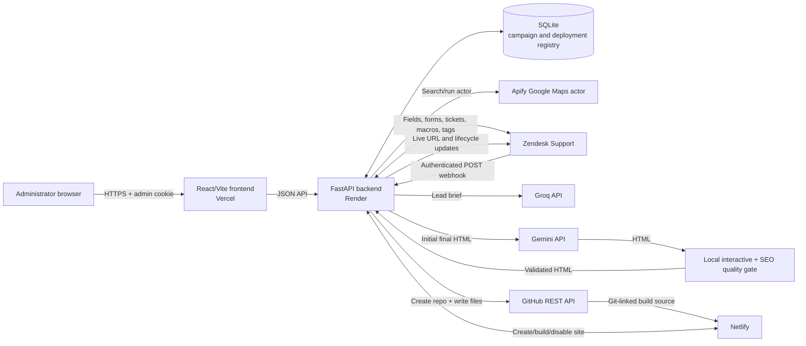
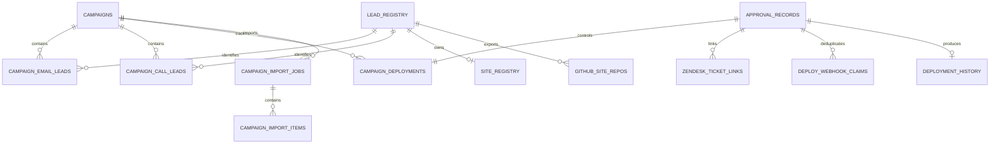
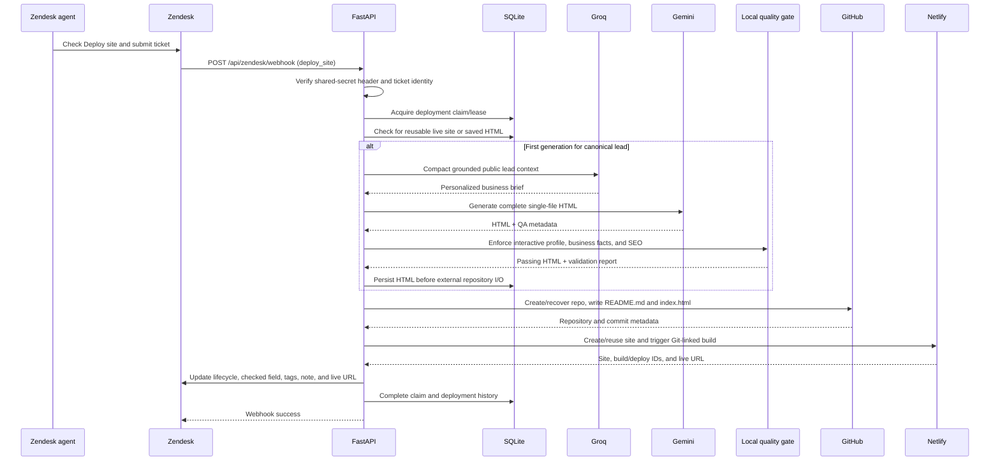
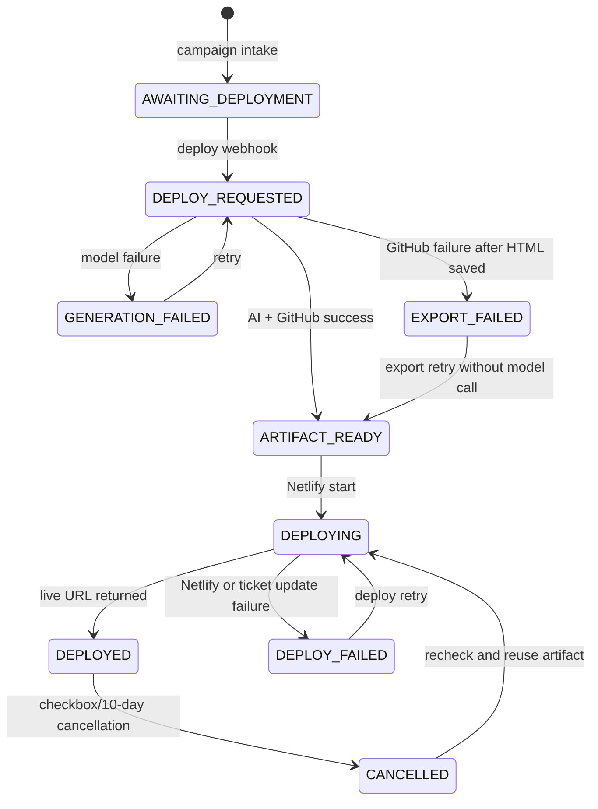

# AI Site Factory: Architecture, FRS, Business Processes, Use Cases, Webhooks, and Cost Model

**Document status:** As-built specification and operating-cost model  
**System:** AI Site Factory  
**Version:** 1.1  
**Prepared:** 2026-07-22  
**Pricing basis:** Public provider pricing in USD, checked 2026-07-21; taxes, exchange rates, negotiated contracts, and legacy plans are excluded.

## 1. Purpose and scope

This document describes the application as it is implemented in this repository. It connects the business objective to the deployed architecture, functional requirements specification (FRS), business processes, detailed use cases, Zendesk webhook contracts, data model, operating states, security controls, capacity limits, and provider costs.

The product turns public, contactable businesses without websites into agent-controlled website opportunities:

1. Apify or an uploaded file supplies business leads.
2. AI Site Factory rejects businesses that already have a website and leads with neither an email nor a phone number.
3. A campaign must contain both an email route and a phone route.
4. The backend creates separate Zendesk intake tickets for the email and phone queues.
5. No site is generated until an agent selects **AI Site Factory - Deploy site**.
6. The authenticated Zendesk webhook generates a personalized page, applies the highly interactive profile, injects explicit public business details, and runs the SEO validation gate before storing it in a lead-owned GitHub repository.
7. A passing artifact deploys to Netlify and the backend writes the live URL back to the same ticket. Prospect previews are `noindex` by default; indexing requires an explicit `seoIndexingEnabled=true` production decision.
8. Email and phone follow-up remain distinct agent workflows.
9. Unchecking the deploy field disables the Netlify site. A Zendesk automation can perform this after 240 pending hours (10 days) and initiate the correct customer or agent notification.

The document does not treat a unit test as proof that a live third-party account is funded, correctly licensed, or currently within quota. Those concerns are covered separately in the operational acceptance checklist.

## 2. Business objectives and boundaries

### 2.1 Objectives

| Objective | Business outcome | Primary measure |
|---|---|---|
| Find viable prospects | Retain public businesses with no website and at least one contact route | Eligible leads / raw places scraped |
| Support both sales channels | Create separate email and phone work queues | Email-ticket count and phone-ticket count |
| Keep agents in control | Do not spend AI or deployment capacity until an agent requests it | Deploy requests / channel records |
| Produce a traceable artifact | Create one auditable GitHub repository per canonical business | Repositories created and reused |
| Publish a usable preview | Deploy a mobile-friendly, personalized page | Successful Netlify deployments |
| Enforce generated-site quality | Require explicit business facts, accessible interaction, and validated SEO structure before export | SEO gate pass/fail and stored validation report |
| Close the loop in Zendesk | Put status, notes, tags, and the live URL on the originating ticket | Ticket updates completed |
| Control stale previews | Disable an unaccepted site after the configured 10-day period | Scheduled cancellations completed |
| Recover from restarts | Restore selected managed state from Zendesk and seed data | Recovered campaigns and deployments |

### 2.2 In scope

- Administrator login and session protection.
- API Safety Center provider configuration status and read-only probes.
- Zendesk connection, instance inspection, fields/forms/views/webhook provisioning, and stored field mapping.
- Apify discovery and CSV/JSON/JSONL upload.
- Campaign metadata entry or automatic name/industry suggestions.
- Mixed email and phone campaign enforcement.
- Separate email and call lead records.
- Deferred AI site generation.
- Highly interactive generated-site profile using Bootstrap 5.3.8, Alpine.js 3.15.12, GSAP 3.15, and Motion Mini 12.42.2 with reduced-motion handling.
- Deterministic business-detail tabs and fact-based FAQs containing all available public business details.
- Pre-export SEO enforcement for title, description, robots policy, Open Graph/Twitter metadata, one H1, image alt attributes, and `LocalBusiness` JSON-LD.
- Preview-safe `noindex` defaults with an explicit production-indexing flag.
- GitHub repository creation and recovery after partial failure.
- Netlify Git-linked deployment with a direct API fallback.
- Zendesk webhook actions for deployment, cancellation, approved email, and phone status.
- 10-day cancellation handoff driven by Zendesk tags and automations.
- Dashboard reporting, deployment history, health, logs, and restart recovery.

### 2.3 Out of scope or external responsibility

- The legality and commercial policy for a particular outreach campaign. An operator must establish a lawful basis, consent rules, suppression lists, and applicable POPIA/GDPR/marketing compliance.
- Domain purchase, custom-domain DNS, invoicing, customer acceptance, and transfer of ownership.
- An outbound dialer; the phone route produces an agent workflow.
- A general email delivery service; email-channel public replies are posted through Zendesk.
- Creating a brand in Zendesk. The setup flow deliberately selects an existing brand.
- Provider subscription purchasing and account-level quotas.
- Guaranteed extraction of email addresses for no-website businesses. Email discovery is inherently sparse because most business-email enrichment depends on a website or another public profile.

## 3. Actors and systems

| Actor/system | Responsibility |
|---|---|
| Administrator | Signs in, configures Zendesk, checks API safety, launches/imports campaigns, and reviews reporting. |
| Zendesk agent | Owns the customer conversation, requests deployment, uses channel macros, and records phone outcomes. |
| Prospective business/customer | Receives an email or phone contact and may accept, reject, or ignore the proposed site. |
| React/Vite frontend | Provides the admin dashboard, setup, campaign, lead, deployment, theme, accessibility, and diagnostics interfaces. |
| FastAPI backend | Applies business rules, persists workflow state, calls providers, authenticates webhooks, and exposes reporting APIs. |
| SQLite | Stores campaign, lead, approval, provider, webhook, and deployment state. |
| Apify | Discovers public business-listing data. |
| Zendesk | Serves as the agent work queue and automation/orchestration surface. |
| Groq | Compacts public lead context into a grounded business brief. |
| Gemini | Produces the initial final single-file personalized HTML document. |
| Local generated-site quality layer | Enforces the interactive profile, explicit business facts, metadata, structured data, reduced-motion behavior, and the blocking SEO validation report. |
| GitHub | Stores `index.html` and `README.md` in one repository per canonical lead. |
| Netlify | Builds and hosts the generated site and supports disable/re-enable operations. |
| Vercel | Hosts the static administration frontend. |
| Render | Hosts the FastAPI backend and, on the declared paid configuration, its persistent SQLite disk. |

## 4. As-built architecture



### 4.1 Deployment topology

| Layer | Current implementation | Important constraint |
|---|---|---|
| Frontend | React 19 + Vite on Vercel | `frontend/dist` is the build output; browser API requests use credentials for the admin cookie. |
| Backend | Python/FastAPI on Render | Webhook requests can take long enough to include AI, GitHub, and Netlify operations; long synchronous work should move to a queue before high scale. |
| Database | SQLite at `PIPELINE_DB_PATH` | Durable production use requires the paid Render service and persistent disk declared in `render.yaml`. |
| Upload storage | `CAMPAIGN_UPLOAD_DIR` | Uploaded files are temporary job inputs and require the same persistent disk while a job is incomplete. |
| Generated artifact | A public or private GitHub repo per canonical lead | GitHub is the durable copy of validated `index.html`; private-repo support also depends on the Netlify plan/integration. The current exporter does not yet create `robots.txt` or `sitemap.xml`. |
| Generated site | Netlify site linked to the GitHub repo | A production deploy consumes Netlify credits; disable retains the GitHub artifact. |
| Workflow | Zendesk ticket fields, tags, triggers, automations, and macros | The backend provisioner creates the core resources but intentionally leaves newly created triggers inactive for review. The 10-day macros/automations must exist in the connected instance. |

### 4.2 Persistent and recoverable state

The checked-in Render blueprint specifies:

- Starter web service.
- 1 GB disk mounted at `/var/data`.
- SQLite at `/var/data/pipeline.db`.
- campaign uploads at `/var/data/uploads`.

A Free Render web service cannot attach this disk. Its local SQLite file is lost on restart, spin-down, or redeploy. The code mitigates—not eliminates—this risk through seed restoration and read-only recovery from managed Zendesk tickets. Untouched intake campaigns and pending upload files do not have a complete external copy and therefore still require persistent storage.

## 5. Core data architecture



| Table/group | Purpose |
|---|---|
| `lead_registry`, `lead_identity_index`, `campaign_lead_identity_claims` | Canonical identity and duplicate prevention across campaigns. |
| `discovery_batches` | Apify query, counts, warnings, and normalized result metadata. |
| `campaigns` | Campaign name, industry, query, location, target, mixed-channel filter, and status. |
| `campaign_email_leads` | Email work queue, approval, ticket, deploy request, and deployment link. |
| `campaign_call_leads` | Phone work queue, approval, ticket, deploy request, and deployment link. |
| `campaign_deployments` | Per-channel deployment ledger and dashboard metrics such as AI generations, repo creation, pending, failed, and live. |
| `campaign_import_jobs`, `campaign_import_items` | Durable chunked CSV/JSON/JSONL processing and per-row retry status. |
| `pipeline_runs`, `pipeline_steps` | Traceable execution and step-level success/failure history. |
| `approval_records` | Public lead context, generated HTML, checksum, selected interactive profile, SEO validation report, GitHub export, outreach, and approval/deployment status. |
| `deploy_webhook_claims` | Lease-based idempotency for repeated/concurrent deploy webhooks. |
| `github_site_repos`, `site_registry`, `deployment_history` | Artifact ownership, repo/commit metadata, Netlify IDs, URL, state, and history. |
| `zendesk_field_settings`, `zendesk_provisioned_resources` | Discovered Zendesk IDs and setup reconciliation state. |
| `zendesk_ticket_links`, `zendesk_webhook_events` | Ticket identity, channel, tags, payload snapshots, and webhook audit events. |

## 6. Business process architecture

### 6.1 Setup process

1. Configure backend secrets for Apify, Gemini, Groq, GitHub, Netlify, Zendesk, and administrator authentication.
2. The administrator signs in using the backend-verified credential.
3. In Zendesk Setup, the administrator supplies subdomain, administrator email/username, and API token.
4. The backend validates the connection and inspects the instance without writing.
5. The administrator selects an existing Zendesk brand and authorizes provisioning.
6. Provisioning creates/reconciles fields first, then separate email/phone forms, optional views, the authenticated webhook, and five inactive core triggers.
7. The administrator reviews and activates tested triggers in Zendesk.
8. The API Safety Center can perform provider-specific probes without returning secret values.

### 6.2 Lead-to-ticket process

1. The administrator chooses **Find leads** or **Upload lead data**.
2. Campaign name, industry, location, and search intent can be entered freely; name/industry can instead be suggested from discovered/imported records.
3. Search always requests both `email` and `phone`; the backend ignores a narrower client channel selection.
4. Discovery normalizes records and rejects:
   - leads with an existing website;
   - leads without either phone or email;
   - duplicate/canonical identities already claimed or generated.
5. The selection algorithm attempts a mixed contact set.
6. Campaign creation fails if the resulting set lacks an email route or a phone route.
7. The backend creates approval placeholders but does not generate HTML.
8. It creates/reuses a Zendesk organization and a business-named end-user requester, then creates separate email and/or phone tickets with the correct form, brand, fields, tags, and private intake note.
9. SQLite stores the channel record and ticket ID.

### 6.3 Agent-requested deployment process



Important controls:

- The generated HTML is persisted before GitHub I/O. A transient GitHub error can therefore retry without paying for another model generation.
- The canonical lead key supports artifact/site reuse between an email and phone record for the same business.
- Deploy claims return `IN_PROGRESS` or `ALREADY_PROCESSED` for duplicate webhook delivery rather than generating a second site.
- The final page uses the supplied main business image where available, derives an industry-appropriate theme, includes personalized services/captions, and adds a deterministic SVG fallback when no public main image is available.
- The quality layer uses Bootstrap as the sole styling framework, adds version-pinned Alpine.js for crawlable tabs/FAQs, retains GSAP hero choreography, and adds Motion Mini viewport reveals/micro-interactions. Both animation paths respect `prefers-reduced-motion`.
- A deterministic Business Details section exposes every available supplied business fact: name, industry, location, address, phone, email, rating/review count, source listing, and contact actions. Missing facts are omitted rather than invented.
- The SEO gate blocks export unless the document has a doctype/language, unique business title, description, valid robots policy, one H1, explicit facts, image alt attributes, interactive-profile assets, and parseable matching `LocalBusiness` JSON-LD. The report is stored in `site_content_json` and the pipeline records a local `seo_validation` step.
- Prospect previews receive `noindex, nofollow`. `index, follow, max-image-preview:large` is emitted only when the context explicitly sets `seoIndexingEnabled=true`; canonical URL generation remains deferred until a final production domain exists.

### 6.4 Channel follow-up process

**Email channel**

1. The agent reviews the live site and prepared message.
2. The separate **Send approved email** checkbox fires `send_email`.
3. The backend posts a public Zendesk reply with the preview link and marks the email workflow fields/tags.

**Phone channel**

1. The live URL stays on the ticket for the assigned agent.
2. The agent calls the business and uses the approved call macro/script.
3. A `phone_status` webhook can add a private status note and update the managed call-status field.

### 6.5 Cancellation and 10-day process

1. The deployed-customer notification macro adds `asf_customer_notified_deployed` and `asf_10_day_clock_started`, and sets the ticket to pending.
2. Zendesk waits until the ticket has been pending for 240 hours.
3. The email or phone automation adds `asf_10_day_cancellation_due` and unchecks **Deploy site**.
4. The corresponding cancellation trigger sends `cancel_deployment` to the backend.
5. The backend locates the Netlify site from SQLite or the ticket live URL, disables it, clears local live state and the ticket live URL, retains the GitHub repo, and adds cancellation tags.
6. If the due tag proves this is scheduled cancellation:
   - email: the backend renders and applies `AI Site Factory::Email::10-day cancellation - notify customer` as a public message;
   - phone: the Zendesk follow-up rule waits for `asf_deployment_cancelled`, reopens the ticket, and adds a private instruction to call using `AI Site Factory::Phone::10-day cancellation - call script`.
7. Rechecking Deploy site can re-enable/redeploy the same lead-owned artifact.

## 7. Functional Requirements Specification (FRS)

The priority notation is MoSCoW: Must, Should, Could.

| ID | Requirement | Priority | Acceptance condition |
|---|---|---:|---|
| FR-AUTH-01 | The backend shall require an administrator session when authentication is configured. | Must | Protected API without a valid cookie returns 401. |
| FR-AUTH-02 | The administrator password shall be server-side and support PBKDF2-SHA256 hashing. | Must | No plaintext credential is sent to or stored by the frontend; a correct hash authenticates. |
| FR-AUTH-03 | Five failed attempts per IP/username in 15 minutes shall cause temporary rate limiting. | Must | Sixth attempt returns 429 until the window expires. |
| FR-SET-01 | The UI shall expose provider configuration status without exposing secret values. | Must | Safety response reports booleans/variable names and `secretsExposed: false`. |
| FR-SET-02 | An administrator shall be able to run a provider-specific safety probe. | Should | Probe returns status, message, duration, and timestamp. |
| FR-ZD-01 | The system shall connect using Zendesk subdomain, administrator username/email, and API token. | Must | Valid credentials return connected instance information. |
| FR-ZD-02 | Zendesk inspection shall be read-only and identify compatible, missing, conflicting, and plan-dependent resources. | Must | Inspection performs no resource create/update/delete operation. |
| FR-ZD-03 | Provisioning shall create/reconcile fields before forms, then views, then optional webhook automation. | Must | Rerun adopts exact/key-marked resources without duplicates. |
| FR-ZD-04 | Email and phone tickets shall use distinct forms and contact fields. | Must | Email form has email/send fields; phone form has phone/call-status fields. |
| FR-ZD-05 | Each new intake ticket shall use a business-named end user as requester. | Must | Returned requester ID equals the ensured business requester ID. |
| FR-ZD-06 | Provisioned triggers shall initially be inactive for administrator review. | Must | Trigger payload has `active: false`. |
| FR-LEAD-01 | Users shall be able to enter free-form campaign name, industry, location, and search intent. | Must | Values are accepted without requiring a preset label match. |
| FR-LEAD-02 | Users may request automatic campaign name and industry suggestions. | Should | Suggested metadata is derived from normalized lead data. |
| FR-LEAD-03 | Discovery shall exclude leads with a website. | Must | No selected lead has a normalized website URL. |
| FR-LEAD-04 | Discovery shall exclude leads with neither email nor phone. | Must | Every selected lead has at least one contact route. |
| FR-LEAD-05 | Every campaign shall include at least one email route and one phone route. | Must | Intake rejects a single-channel result with a clear 400 response. |
| FR-LEAD-06 | Canonical identities shall prevent duplicate generation across searches/campaigns. | Must | Previously claimed/generated identity is skipped or reused. |
| FR-IMP-01 | The system shall import CSV, JSON, and JSONL with flexible known headings. | Must | Supported files become a durable import job. |
| FR-IMP-02 | Imports shall process in small resumable chunks and preserve row errors. | Must | Interrupted job resumes remaining rows; failed rows can be retried. |
| FR-CAM-01 | Campaigns shall persist separate email and phone queues plus a deployment ledger. | Must | Database contains corresponding channel/deployment rows. |
| FR-CAM-02 | Campaign and dashboard views shall report discovered, channel, ticket, requested, AI, repo, pending, failed, and live counts. | Must | API totals match stored rows. |
| FR-AI-01 | Campaign intake shall not call an AI model. | Must | Approval begins at `AWAITING_DEPLOYMENT` with no generated HTML. |
| FR-AI-02 | First deploy request shall generate a grounded business brief and final HTML. | Must | Groq brief and complete HTML are persisted. |
| FR-AI-03 | Generated copy shall use public supplied data and shall not invent unsupported claims. | Must | Prompt and deterministic validation enforce grounded content. |
| FR-AI-04 | Generated sites shall be personalized by business, services, caption, image, and color theme. | Must | Output contains the authoritative business profile, working CTA, theme controls, and exact main image when supplied. |
| FR-AI-05 | Existing saved HTML shall be reused after downstream failure. | Must | GitHub retry does not increment AI generation count. |
| FR-AI-06 | Generated sites shall use the highly interactive profile without loading multiple styling frameworks. | Must | Output uses Bootstrap 5.3.8, Alpine.js 3.15.12, GSAP 3.15, and Motion Mini 12.42.2; the quality layer removes Tailwind browser CDN and Animate.css references returned by the model. |
| FR-AI-07 | Generated sites shall explicitly display every available supplied public business detail. | Must | Business Details tabs/FAQs contain the name, industry, location and every available address, phone, email, rating/review count, and source listing without invented values. |
| FR-SEO-01 | The backend shall deterministically normalize essential metadata and structured data. | Must | Output contains a business-specific title/description, robots rule, Open Graph/Twitter tags, one H1, image alt attributes, and matching `LocalBusiness` JSON-LD. |
| FR-SEO-02 | Generated HTML shall pass a blocking local SEO validation gate before GitHub export. | Must | A failed check raises `SiteSeoValidationError`; a pass adds the gate marker, persists the report, and records `seo_validation` as completed. |
| FR-SEO-03 | Prospect previews shall not be indexed unless production indexing is explicitly enabled. | Must | Default robots content is `noindex, nofollow`; only `seoIndexingEnabled=true` emits `index, follow, max-image-preview:large`. |
| FR-SEO-04 | Canonical URL and sitemap publication shall wait for a final production domain. | Should | Gate reports a canonical warning without inventing a Netlify/custom-domain URL; roadmap retains domain-aware canonical/sitemap work. |
| FR-GIT-01 | One canonical lead shall own one recoverable GitHub site repository. | Must | Partial repo is found/reused before a new repo is created. |
| FR-GIT-02 | Each site repo shall contain `README.md` and `index.html` plus commit/checksum metadata. | Must | Export record contains repo, branch, commit SHA, and HTML checksum. |
| FR-NET-01 | Default publication shall create/reuse a Git-linked Netlify site. | Must | Deployment records site/build/deploy IDs and public URL. |
| FR-NET-02 | A direct Netlify deploy may be used as an explicit fallback. | Should | Fallback status/publish mode remains auditable. |
| FR-WH-01 | Zendesk webhook requests shall require a matching secret header. | Must | Missing/wrong secret returns 401 and records a rejected event. |
| FR-WH-02 | Webhook identity shall match managed approval, canonical lead, ticket, and channel state. | Must | Conflicting identity returns 409. |
| FR-WH-03 | Repeated deploy webhooks shall be idempotent. | Must | Claim lease prevents concurrent/repeated generation. |
| FR-DEP-01 | Successful deployment shall update the originating ticket with lifecycle notes, tags, checked field, and live URL. | Must | Ticket contract is verified after update. |
| FR-DEP-02 | A channel sibling for the same lead shall reuse a ready live deployment. | Must | No duplicate AI generation/repo/site is created. |
| FR-CAN-01 | Unchecking Deploy site after deployment shall disable Netlify and retain GitHub. | Must | Site is disabled, URL cleared, repo metadata retained. |
| FR-CAN-02 | Scheduled cancellation shall be identified by `asf_10_day_cancellation_due`. | Must | Backend reports `scheduled: true` only when live ticket contains tag. |
| FR-CAN-03 | Scheduled email cancellation shall apply the existing customer macro after Netlify is disabled. | Must | Public macro comment is persisted only after successful disable. |
| FR-CAN-04 | Scheduled phone cancellation shall hand off to an agent call note/script. | Must | Phone follow-up tag/trigger opens the agent task. |
| FR-REC-01 | Startup shall reconcile stable Zendesk field markers and restore allowed managed state when configured. | Should | Empty database can recover selected deployed/cancelled/failed demo records. |
| FR-OBS-01 | Pipeline steps and webhook events shall be auditable without secret leakage. | Must | Logs/events contain IDs and sanitized errors, never raw tokens. |
| FR-UX-01 | The UI shall support light/dark theme, reduced motion, text scaling, contrast, and focus visibility. | Should | Preferences change the rendered interface and persist locally. |

## 8. Non-functional requirements

| ID | Requirement | Target/interpretation |
|---|---|---|
| NFR-SEC-01 | Secret isolation | Provider tokens remain in backend environment variables and are redacted from logs/API responses. |
| NFR-SEC-02 | Transport security | Production browser/API/provider traffic uses HTTPS. |
| NFR-SEC-03 | Webhook authentication | Use a high-entropy `ZENDESK_WEBHOOK_SECRET` sent only in the configured header. |
| NFR-SEC-04 | Least privilege | GitHub token can create/read/write required repos only; Zendesk token belongs to a controlled administrator; rotate all shared secrets. |
| NFR-REL-01 | Idempotency | Campaign requests, Zendesk external IDs, GitHub partial exports, and deploy claims must tolerate retries. |
| NFR-REL-02 | Persistence | Production SQLite and uploads reside on a persistent disk with backup/restore procedures. |
| NFR-PERF-01 | Interactive reads | Dashboard GET requests should normally complete in under 2 seconds excluding Render cold start. |
| NFR-PERF-02 | Long work | AI/deploy work should complete inside Zendesk/Render request time limits for the POC; production scale requires a durable job queue. |
| NFR-PERF-03 | Generated-site payload | Version-pinned interactive libraries are loaded once, Bootstrap remains the only styling framework, and production acceptance includes Lighthouse/mobile performance testing. |
| NFR-SCALE-01 | Batch safety | Large imports are chunked; outbound calls honor provider 429 and retry headers. |
| NFR-ACC-01 | Accessibility | Generated pages and admin UI use semantic structure, keyboard-operable tabs/FAQs, focus state, readable contrast, alt text, and `prefers-reduced-motion` support. |
| NFR-PRIV-01 | Data minimization | Store only public lead/business details required by the workflow; define retention/deletion policies before production. |
| NFR-OBS-01 | Correlation | Requests, pipelines, approvals, canonical leads, tickets, repos, and deploys have stable IDs. |
| NFR-FIN-01 | Cost traceability | Production shall record provider usage units per deployment before volume rollout. This is a documented gap today. |

## 9. Detailed use cases

### UC-01 — Administrator login

- **Actor:** Administrator.
- **Preconditions:** `ADMIN_USERNAME`, `ADMIN_PASSWORD_HASH`, and preferably `ADMIN_SESSION_SECRET` exist on the backend.
- **Trigger:** User submits username/password.
- **Main flow:** Backend rate-checks the identity, verifies PBKDF2-SHA256, issues an HMAC-signed HTTP-only cookie, and returns session expiry.
- **Alternates:** Invalid credentials return 401; excessive failed attempts return 429; auth remains optional only when no admin credential is configured.
- **Postcondition:** Protected dashboard APIs accept the session until expiry/logout/credential rotation.

### UC-02 — Connect and provision Zendesk

- **Actor:** Administrator.
- **Preconditions:** Zendesk administrator API token; plan supports required custom forms/features.
- **Trigger:** Connect, Inspect, then explicitly authorize Provision.
- **Main flow:** Validate account; inventory resources; select existing brand; reconcile 20 managed fields, two forms, optional views, webhook, and inactive triggers in dependency order.
- **Exceptions:** Type conflict, missing multiple-form capability, inaccessible brand, invalid API credentials, or non-HTTPS webhook URL blocks relevant work.
- **Postcondition:** Stable field IDs and resource IDs are stored; campaign workspace is unlocked.

### UC-03 — Discover a mixed campaign with Apify

- **Actor:** Administrator.
- **Preconditions:** Zendesk ready; Apify token configured.
- **Trigger:** Submit free-form name/industry/location/search intent and target.
- **Main flow:** Invoke configured actor; normalize; filter website/no-contact/duplicates; select mixed leads; create campaign and tickets.
- **Exceptions:** Provider failure uses demo fallback in the discovery endpoint; however, a real campaign must still satisfy mixed-channel validation. Sparse email data may require a different search/enrichment strategy.
- **Postcondition:** Separate email and phone records/tickets exist; no site exists.

### UC-04 — Import lead data

- **Actor:** Administrator.
- **Preconditions:** Zendesk ready; supported file.
- **Trigger:** Upload CSV, JSON, or JSONL.
- **Main flow:** Normalize headings, derive/supply campaign metadata, validate mixed channels, create durable job, process small chunks, and create tickets.
- **Exceptions:** Malformed/unsupported rows are recorded; failed items can be reset and retried.
- **Postcondition:** Completed rows have approval/channel/ticket links; input file is removed after all rows finish.

### UC-05 — Request a site from Zendesk

- **Actor:** Zendesk agent.
- **Preconditions:** Managed email/phone intake ticket; deploy trigger active; webhook secret correct.
- **Trigger:** Agent checks **Deploy site** and submits.
- **Main flow:** Zendesk calls `deploy_site`; backend validates identity/claim; generates or reuses HTML; enforces the highly interactive profile and explicit business details; normalizes metadata/`LocalBusiness` JSON-LD; passes the blocking SEO gate; persists the report/artifact; exports GitHub; deploys Netlify; updates the ticket.
- **Exceptions:** Invalid secret 401; orphan/mismatched identity 404/409; model/provider failure 502/500; SEO gate failure raises a generation failure before export; every failure receives a private note and retryable state where appropriate.
- **Postcondition:** Ticket has a live preview URL and `asf_deployed`/`asf_stage_live`, or a clear failed state. The preview remains `noindex` until production indexing is explicitly enabled.

### UC-06 — Send approved email

- **Actor:** Zendesk agent.
- **Preconditions:** Email-channel ticket and live site.
- **Trigger:** Agent checks **Send approved email**.
- **Main flow:** Zendesk calls `send_email`; backend creates/uses grounded outreach text and posts a public ticket reply.
- **Postcondition:** Email sent fields/tags and ticket audit are updated.

### UC-07 — Record phone outcome

- **Actor:** Zendesk agent or dialer integration.
- **Preconditions:** Phone-channel ticket.
- **Trigger:** `phone_status` webhook with a status value.
- **Main flow:** Backend writes a private note, managed call-status/lead-status fields, tags, and ticket-link snapshot.
- **Postcondition:** Agent outcome is reportable without sending an email.

### UC-08 — Immediate cancellation

- **Actor:** Zendesk agent.
- **Preconditions:** Managed deployed ticket.
- **Trigger:** Agent unchecks Deploy site.
- **Main flow:** Zendesk calls `cancel_deployment`; backend disables Netlify, clears URL/state, preserves GitHub, and notes the ticket.
- **Postcondition:** Site is not publicly served and ticket contains cancellation state.

### UC-09 — Scheduled 10-day cancellation

- **Actor:** Zendesk automation, then backend; an agent participates for phone channel.
- **Preconditions:** Customer-deployed notification started the pending clock; ticket remains eligible for 240 hours.
- **Trigger:** Automation adds due tag and unchecks deploy field.
- **Main flow:** Same cancellation webhook runs; backend confirms due tag before applying channel-specific post-cancel behavior.
- **Postcondition:** Email customer receives the cancellation macro, or phone agent receives call instruction after successful cancellation.

### UC-10 — Restore state after backend loss

- **Actor:** Startup process or administrator.
- **Preconditions:** Empty/incomplete database; valid Zendesk connection; managed tickets carry stable tags/fields.
- **Trigger:** Configured startup recovery or `POST /api/campaigns/restore-zendesk`.
- **Main flow:** Reconcile field markers; read only exact managed tickets; reconstruct campaign/approval/deployment links idempotently.
- **Postcondition:** Selected dashboard state returns without creating/updating Zendesk tickets.
- **Limitation:** Pending import files and arbitrary untouched intake state are not fully reconstructible without disk persistence.

### UC-11 — Monitor system and cost-relevant metrics

- **Actor:** Administrator/operations.
- **Preconditions:** Authenticated session.
- **Trigger:** Open Overview, Deployments, Settings/API Safety, or pipeline detail.
- **Main flow:** Read campaign funnel, per-channel records, deployment ledger/history, provider status, pipeline steps, and sanitized logs.
- **Postcondition:** Operator can identify pending, live, failed, cancelled, repo, ticket, and provider states.
- **Gap:** The current ledger counts model generations but not input/output tokens or provider invoice units.

## 10. Zendesk form and field architecture

The backend provisions fields by stable internal key. IDs are discovered from the target instance and must not be hard-coded in business logic or user instructions.

| Group | Managed keys | Email form | Phone form |
|---|---|:---:|:---:|
| Campaign/identity | `campaignId`, `campaignName`, `canonicalLeadKey`, `pipelineId`, `approvalId`, `batchId` | Yes | Yes |
| Business | `businessName`, `contactName`, `industry`, `location`, `address`, `sourceUrl` | Yes | Yes |
| Contact | `contactEmail` | Yes | No |
| Contact | `contactPhone` | No | Yes |
| Workflow | `contactChannel`, `leadStatus`, `deployRequested`, `liveUrl` | Yes | Yes |
| Email approval | `emailSendRequested` | Yes | No |
| Call outcome | `phoneCallStatus` | No | Yes |

Forms:

- `AI Site Factory - Email Lead`
- `AI Site Factory - Call Lead`

Default views:

- `AI Site Factory - Email Leads`
- `AI Site Factory - Call Leads`
- `AI Site Factory - Deployed Sites`

### 10.1 Lead-status values

- Awaiting deployment
- Generating site
- Deployed
- Email sent
- Phone updated
- Failed

### 10.2 Phone-status values

- New
- Attempted
- Connected
- Follow up
- Qualified
- Not interested
- No answer
- Other

### 10.3 Stable lifecycle tag groups

| Stage | Representative tags |
|---|---|
| Intake/source/channel | `asf_managed`, `asf_intake`, `asf_form_email_lead`, `asf_form_call_lead`, `asf_channel_email`, `asf_channel_phone`, `asf_source_apify_google_maps`, `asf_source_upload` |
| Awaiting request | `asf_deploy_pending`, `asf_can_deploy`, `asf_stage_intake` |
| Generating/exporting | `asf_deploy_requested`, `asf_stage_generating`, `asf_artifact_ready`, `asf_repo_ready`, `asf_stage_deploying` |
| Live/follow-up | `asf_deployed`, `asf_stage_live`, `asf_email_send_pending`, `asf_call_pending`, `asf_email_sent`, `asf_phone_updated` |
| 10-day clock | `asf_customer_notified_deployed`, `asf_10_day_clock_started`, `asf_10_day_cancellation_due`, `asf_10_day_cancellation_sent`, `asf_phone_cancellation_due`, `asf_phone_cancellation_note_added` |
| Cancelled | `asf_deployment_cancelled`, `asf_stage_cancelled`, `asf_cancel_email_fired`, `asf_cancel_phone_fired` |
| Failed | `asf_generation_failed`, `asf_deploy_failed`, `asf_stage_failed` |

Tags are integration contracts. Renaming/removing them requires coordinated changes across backend code, Zendesk triggers, automations, macros, views, tests, and documentation.

## 11. Webhook and outbound integration contracts

### 11.1 Inbound Zendesk webhook

**Endpoint**

```text
POST /api/zendesk/webhook
Content-Type: application/json
x-ai-site-factory-secret: <same value as backend ZENDESK_WEBHOOK_SECRET>
```

The endpoint also accepts legacy header names `x-webhook-secret` and `x-zendesk-webhook-secret`, but the provisioner uses `x-ai-site-factory-secret`.

**Common body**

```json
{
  "action": "deploy_site",
  "approvalId": "<managed approval field>",
  "canonicalLeadKey": "<managed canonical lead field>",
  "zendeskTicketId": 12345,
  "channel": "email",
  "actor": "Zendesk",
  "notes": "Optional audit note"
}
```

| Action | Allowed channel | Additional input | Result |
|---|---|---|---|
| `deploy_site` | email, phone | none | Generate/reuse, GitHub export, Netlify deploy, ticket live URL. |
| `cancel_deployment` | email, phone | none | Disable Netlify, clear live URL, channel-specific scheduled follow-up. |
| `send_email` | email only | optional `notes` | Public reply through Zendesk and email status/tags. |
| `phone_status` | phone only | `value` | Private status note and call-status field/tags. |

**Response/error semantics**

| HTTP/status | Meaning | Operator action |
|---|---|---|
| 200 `COMPLETED` | Action completed. | Confirm fields/tags/provider result. |
| 200 `IN_PROGRESS` | Duplicate request arrived while a claim lease is active. | Do not manually create another request; wait/refresh. |
| 200 `ALREADY_PROCESSED` | Same deployment claim already completed. | Treat as idempotent success. |
| 400 | Unsupported action or invalid input. | Correct trigger body. |
| 401 | Secret did not match. | Correct webhook authentication; do not expose the secret in ticket text. |
| 404 | Managed approval/ticket could not be resolved. | Check field IDs, stable markers, ticket tags, and recovery. |
| 409 | Identity/channel/state conflict or site not found for cancellation. | Compare ticket ID, approval, canonical key, channel, and live URL. |
| 502 | Downstream generation/export/deploy/ticket contract failure. | Review private ticket note and pipeline step; retry only the failed stage. |
| 500 | Unexpected handler failure. | Use request ID, webhook event, and sanitized backend logs. |

### 11.2 Maintenance media-refresh webhook

```text
POST /api/deployments/refresh-business-media
x-ai-site-factory-secret: <shared secret>
```

Body requires managed Zendesk ticket ID, exact public main image URL, and a GitHub repository owned by the configured GitHub owner. It updates the generated HTML/repo and redeploys the site. Treat it as privileged maintenance, not a public user endpoint.

### 11.3 Outbound calls

| Provider | Main operations | Authentication | Idempotency/retry behavior |
|---|---|---|---|
| Apify | Synchronous actor run and dataset result | API token | Discovery cache/canonical dedupe; limited retry with minimal payload. |
| Zendesk | Inventory/setup, end user/org/ticket create, tags/comments/fields, macros | API token basic auth | External ticket ID, stable field markers, local ticket links; respect 429 `Retry-After`. |
| Groq | JSON chat completion for the business brief | Bearer API key | Saved brief/HTML avoids repeat after downstream failure. |
| Gemini | JSON generation of complete HTML | API key header | Rate/transient fallback exists; saved HTML prevents downstream retry cost. |
| GitHub | Create/find repo and write README/index | Bearer token | Partial repo recovery, content SHA updates, exponential retry for transient failures. |
| Netlify | Create/find/enable/disable site, trigger/poll build/deploy | Bearer token | Canonical site registry and live-URL recovery; direct deploy fallback is auditable. |

Generated browsers additionally fetch version-pinned Bootstrap 5.3.8, Alpine.js 3.15.12, GSAP 3.15, and the Motion Mini 12.42.2 ES module from jsDelivr. These are not authenticated backend provider calls and create no configured per-call API charge, but they add client requests, payload, CDN availability, privacy, and software-supply-chain considerations. The production roadmap should evaluate self-hosting, subresource integrity where published, a Content Security Policy, and Lighthouse budgets.

## 12. State model



The `approval_records` status and `campaign_deployments` status are related but not identical: approvals represent artifact/review state; campaign deployments represent the channel request and live lifecycle. Reporting must use the correct table rather than assuming one string is the entire system state.

The SEO gate is a blocking sub-step between final HTML generation and artifact readiness. A failure remains within the existing generation-failure lifecycle rather than introducing a separate approval status; the detailed pipeline step/error identifies SEO validation as the cause.

## 13. AI model usage and token accounting

### 13.1 Actual deferred-generation calls

For the current Zendesk deployment path, a first-time site normally makes:

1. **One Groq text call** using `llama-3.3-70b-versatile` to compact the public lead into a business brief.
2. **One Gemini text call** to generate the complete final HTML.
3. **Zero image-generation calls by default.** `ENABLE_GEMINI_IMAGES` defaults to false. The final page uses the public main image or an inline business-specific SVG fallback.
4. **Zero outreach-model calls in the current implementation.** The function named `generate_outreach_with_groq` currently builds a deterministic template locally and does not call Groq.
5. **Zero additional model calls for interaction, business-detail enforcement, or SEO validation.** Those steps run deterministically in the FastAPI process after Gemini returns HTML.

A channel sibling or retry after saved HTML can use zero new model calls. A deliberate regeneration creates new Groq/Gemini usage.

### 13.2 Critical configured-model finding

The local environment currently names `gemini-2.0-flash` as `GEMINI_TEXT_MODEL`. Google’s official pricing page says this model was shut down on **2026-06-01**. It is not a valid forward production assumption. Before the next production deployment test, set an available model—`gemini-2.5-flash` is the closest documented migration baseline—and rerun the Gemini safety probe plus a controlled generated-site acceptance test.

This document does not change that environment variable because its purpose is specification and validation, not a provider migration.

### 13.3 Current metering gap

The provider responses contain usage metadata, but the code does not persist input tokens, output tokens, image count, or billed cost. `campaign_deployments.ai_generation_count` records a logical generation, not actual tokens. Prompt-character logs and `MODEL_CHUNK_CHARS` are useful bounds but are not billing records.

Required production enhancement:

```text
provider_usage_ledger
- id
- pipeline_id
- approval_id
- canonical_lead_key
- provider
- model
- operation
- input_tokens
- output_tokens
- images_generated
- provider_request_id
- estimated_cost_usd
- occurred_at
- raw_usage_json (sanitized)
```

Each provider response should write the ledger transactionally before the step is marked completed. Dashboard cost reports should distinguish actual provider usage from estimated pricing.

### 13.4 Token-cost formula

For text models priced per million tokens:

```text
text_cost_usd = (input_tokens / 1,000,000 × input_rate)
              + (output_tokens / 1,000,000 × output_rate)
```

For Gemini images:

```text
image_cost_usd = image_count × image_rate
               + (text_or_image_input_tokens / 1,000,000 × input_rate)
```

For one first-time deploy using the recommended current Gemini text baseline:

```text
AI cost = Groq brief cost + Gemini final-HTML cost + optional image cost
```

## 14. Provider pricing and operating-cost model

Pricing is volatile. Confirm the account’s actual plan and billing screen before a campaign. A legacy plan can differ from the public new-account plan.

### 14.1 Current public rates relevant to this app

| Provider/item | Public rate checked 2026-07-21 | How the app consumes it | Official source |
|---|---:|---|---|
| Groq `llama-3.3-70b-versatile` input | $0.59 / 1M tokens | Lead brief prompt | [Groq pricing](https://groq.com/pricing) |
| Groq `llama-3.3-70b-versatile` output | $0.79 / 1M tokens | Grounded brief JSON | [Groq model page](https://console.groq.com/docs/model/llama-3.3-70b-versatile) |
| Gemini 2.5 Flash input | $0.30 / 1M text/image/video tokens | Recommended replacement final-HTML prompt | [Gemini API pricing](https://ai.google.dev/gemini-api/docs/pricing) |
| Gemini 2.5 Flash output | $2.50 / 1M tokens including thinking | Recommended replacement final HTML | [Gemini API pricing](https://ai.google.dev/gemini-api/docs/pricing) |
| Gemini 2.5 Flash Image | $0.30 / 1M input tokens + $0.039 per image up to 1024×1024 | Only if `ENABLE_GEMINI_IMAGES=true` | [Gemini API pricing](https://ai.google.dev/gemini-api/docs/pricing) |
| Configured Apify actor `compass/crawler-google-places` | From $1.50 / 1,000 scraped places | Discovery before eligibility filtering; add-ons can increase cost | [Actor page](https://apify.com/compass/crawler-google-places) |
| Netlify production deploy | 15 credits | Initial deploy and later production redeploy | [Netlify pricing](https://www.netlify.com/pricing/) |
| Netlify bandwidth | 20 credits / GB | Traffic from all generated sites | [Netlify pricing](https://www.netlify.com/pricing/) |
| Netlify requests | 2 credits / 10,000 | Requests/assets for generated sites | [Netlify pricing](https://www.netlify.com/pricing/) |
| Netlify Free | $0, 300-credit monthly limit | Approximately 20 production deploys if nothing else uses credits | [Netlify pricing](https://www.netlify.com/pricing/) |
| Netlify Personal | $9/month, 1,000 credits; $5/500 add-on credits | Solo production usage | [Netlify pricing](https://www.netlify.com/pricing/) |
| Netlify Pro | Starts $20/month, 3,000 credits; $10/1,500 add-on credits | Team/volume usage | [Netlify pricing](https://www.netlify.com/pricing/) |
| Render Starter web service | $7/month | Always-on FastAPI backend | [Render service comparison](https://render.com/articles/render-vs-railway) |
| Render persistent disk | $0.25 / GB-month | 1 GB SQLite/upload disk = $0.25/month | [Render hosting cost guide](https://render.com/articles/how-much-does-cloud-application-hosting-cost-for-small-businesses) |
| Render Free | $0, no persistent disk; spins down after 15 idle minutes | Demo only; unsafe for durable SQLite | [Render Free docs](https://render.com/docs/free) |
| Vercel Hobby | $0/month for personal/non-commercial use | Static admin frontend | [Vercel pricing](https://vercel.com/pricing) |
| Vercel Pro | $20/month with $20 usage credit | Commercial/team frontend baseline | [Vercel pricing](https://vercel.com/pricing) |
| GitHub REST API | No per-request fee on an eligible GitHub plan; authenticated primary limit 5,000 requests/hour | Repo creation/content writes | [GitHub rate limits](https://docs.github.com/en/rest/using-the-rest-api/rate-limits-for-the-rest-api) |
| Zendesk Support Team | From $19/agent/month billed annually | Ticketing, triggers, automations, macros | [Zendesk pricing](https://www.zendesk.com/pricing/) |

GitHub can be used without a paid plan for this public-repository flow, but paid features, private-repository requirements, storage, Actions, security products, and organization policy can change the bill. The app does not use GitHub Actions for site generation.

### 14.2 Shared monthly baseline

The provider charges fall into two different buckets and should not be mixed together:

- **Shared fixed subscriptions:** Render, Vercel, Netlify, and Zendesk. These exist even in a month with no generated site.
- **Variable campaign usage:** Apify raw places, Groq/Gemini tokens, optional generated images, Netlify production-deploy credits, bandwidth, and requests.

An illustrative small commercial baseline with one Zendesk agent and public GitHub repositories is:

```text
Render Starter + 1 GB disk       $7.25/month
Vercel Pro                       $20.00/month
Netlify Personal                  $9.00/month
Zendesk Support Team, one agent  $19.00/month billed annually
Illustrative fixed subtotal      $55.25/month
```

Use Netlify Pro instead of Personal when team features, private organization repositories, greater concurrency, or more included credits are required; that changes this illustrative subtotal to **$66.25/month**. Apify subscription/usage, AI tokens, additional Zendesk agents, taxes, domains, and overages are extra. A $0 demo is possible across free tiers, but Render Free cannot provide durable SQLite storage and Vercel states that Hobby is for personal/non-commercial use, so $0 is not the production recommendation.

### 14.3 Illustrative per-site AI estimate

These are planning examples, not measured usage. They assume one first-time generation, no generated images, and Gemini 2.5 Flash replacing the shut-down text model. The expanded interactive/SEO prompt may increase Gemini output tokens within these ranges; the deterministic backend additions themselves consume no AI tokens.

| Scenario | Groq input/output | Gemini input/output | Estimated text AI cost/site |
|---|---:|---:|---:|
| Low | 2,000 / 700 | 3,000 / 5,000 | **$0.0151** |
| Typical | 3,000 / 1,000 | 4,000 / 8,000 | **$0.0238** |
| High | 8,000 / 2,000 | 8,000 / 16,000 | **$0.0487** |

Typical calculation:

```text
Groq = 3,000/1M × $0.59 + 1,000/1M × $0.79 = $0.00256
Gemini = 4,000/1M × $0.30 + 8,000/1M × $2.50 = $0.02120
Total text AI = $0.02376 per first-time generated site
```

If five Gemini 2.5 Flash images are enabled, add approximately `5 × $0.039 = $0.195` plus small input-token cost. That is much larger than the text estimate, which is why existing business images and inline SVG fallbacks are the economical default.

### 14.4 Per-site platform estimate

| Cost component | Per first-time deployed lead | Notes |
|---|---:|---|
| Apify discovery | `raw_places × actor_rate` allocated across eligible leads | Cost is per scraped place, not per eligible lead. If only 20% qualify, discovery cost per retained lead is roughly 5× the raw place rate. |
| Text AI typical | ~$0.0238 | Zero on artifact/site reuse; more on regeneration. |
| Interactive profile and SEO gate | $0 direct provider usage | Local HTML processing only; larger HTML and client library payload can affect hosting/CDN traffic and performance. |
| Optional five AI images | ~$0.195 | Default is disabled. |
| Netlify production deploy | 15 credits | Approximately $0.10 at the Pro add-on pack equivalent, or $0.15 at the Personal add-on pack equivalent; included credits should be allocated first. |
| GitHub artifact | Usually $0 incremental for public repos | Subject to plan/policy/rate limits. |
| Zendesk | Seat subscription, not per ticket | Allocate monthly agent cost across campaigns if a fully loaded cost is required. |
| Render/Vercel | Monthly fixed/shared infrastructure | Allocate by deployments or campaigns; not charged per AI token. |

### 14.5 Example: 100-lead campaign

Assumptions:

- 500 raw places scraped to retain 100 eligible mixed no-website leads (20% qualification).
- Configured Apify base rate only, no paid enrichment/add-ons.
- 25 of the 100 leads are selected by agents for deployment.
- Typical text token usage; images remain disabled.
- One Netlify production deploy per selected lead.

```text
Apify: 500 / 1,000 × $1.50                    = $0.75
AI: 25 × $0.02376                              = $0.59
Netlify: 25 × 15 credits                        = 375 credits
Shared monthly infra at declared paid baseline  = Render $7.25 + Vercel/Zendesk/Netlify plan as applicable
```

The first 20 Netlify production deploys alone can consume the 300-credit Free limit. At 25 deployments, traffic and requests aside, the account needs more than Free’s monthly credit limit.

### 14.6 Example: 10,000-lead campaign

The design’s most important cost control is deferred generation. If 10,000 leads are found but only 5% are deployed, AI and Netlify deploy cost apply to 500, not 10,000.

| Deployment rate | Sites generated/deployed | Typical text AI | Netlify production credits | Approx. Apify base if 50,000 raw places were required |
|---:|---:|---:|---:|---:|
| 1% | 100 | ~$2.38 | 1,500 | $75 |
| 5% | 500 | ~$11.88 | 7,500 | $75 |
| 25% | 2,500 | ~$59.40 | 37,500 | $75 |
| 100% | 10,000 | ~$237.60 | 150,000 | $75 |

This table excludes Apify enrichment/add-ons, generated images, traffic, Zendesk/Vercel/Render subscriptions, taxes, retries before artifact persistence, and manual regenerations. Qualification yield is the largest discovery-cost variable. Netlify production-deploy credits—not text AI—are likely to dominate the per-deployment variable cost in this workload.

## 15. Capacity, quota, and scale analysis

### 15.1 GitHub

- Authenticated REST primary limit: 5,000 requests/hour.
- Secondary content creation guidance: generally no more than 80 content-generating requests/minute and 500/hour.
- A new lead normally creates a repo and writes two files, so at least three content mutations are expected before reads/retries.
- A 10,000-site burst cannot safely run as one synchronous loop. Queue and throttle repository creation, inspect rate-limit headers, and apply exponential backoff.

### 15.2 Zendesk

Official Support API limits vary by plan: 200 requests/minute for Team, 400 for Growth/Professional, 700 for Enterprise, and 2,500 for Enterprise Plus/high-volume configurations. Ticket updates also have endpoint limits. See [Zendesk rate limits](https://developer.zendesk.com/api-reference/introduction/rate-limits/).

One business may produce two tickets if it has both email and phone data. A 10,000-lead campaign can therefore create more than 10,000 channel records/tickets. Use durable import chunks, honor `Retry-After`, and meter tickets created per minute.

### 15.3 Apify and the mixed-channel constraint

The configured actor can return phones directly from Google Maps listings. Emails are often found only through a business website or enrichment source. Because this app intentionally rejects businesses with websites, email-qualified no-website leads will be uncommon. “Always mixed” is a campaign acceptance rule, not a promise that every search query can produce a mixed result.

Operational options:

- Search broader geography/industries and over-fetch before applying the no-website filter.
- Enable a lawful email/business-lead enrichment source that does not require retaining a website lead.
- Import a verified mixed dataset.
- Do not fabricate email addresses or weaken the no-contact/no-website rules merely to satisfy the UI.

### 15.4 Backend concurrency

The webhook currently performs model, GitHub, Netlify polling, and Zendesk updates synchronously. For dozens of deployments this is acceptable as a POC. For hundreds/thousands:

1. Accept and validate the webhook quickly.
2. Write a durable deployment job and return 202.
3. Process jobs with controlled provider-specific concurrency.
4. Renew an idempotency lease while working.
5. Update Zendesk asynchronously on each state transition.
6. Add a dead-letter queue and administrator retry control.

## 16. Security, privacy, and failure controls

### 16.1 Existing controls

- PBKDF2-SHA256 administrator password support with signed HTTP-only session cookie.
- Login-attempt rate limiting.
- Public-path allowlist; dashboard APIs require a session when configured.
- CORS credential support restricted to local/Vercel origins.
- Independent shared-secret authentication for Zendesk and maintenance webhooks.
- Secret-key redaction pattern and sanitized provider errors/logs.
- Stable ticket identity checks across approval ID, canonical key, ticket ID, and channel.
- No generated page form submission or tracking pixel is allowed by the HTML prompt contract.
- GitHub and Netlify retries/recovery minimize duplicated artifacts and spend.

### 16.2 Required hardening before production scale

- Replace the shut-down Gemini text model configuration.
- Use a cryptographically random admin session secret and webhook secret; rotate tokens after any exposure.
- Move Zendesk credentials from UI session overrides to a managed secret store for a controlled production instance.
- Add database backups and restore drills; a single persistent disk is not a backup.
- Add per-provider usage ledger, budgets, and alerts.
- Add a durable background queue and concurrency/rate-limit policy.
- Review public generated repos for personal/contact data minimization and retention.
- Add CSRF defense or strict Origin validation for cookie-authenticated state-changing dashboard routes.
- Add Content Security Policy and generated-HTML dependency allowlisting.
- Establish a lead deletion/suppression workflow across SQLite, Zendesk, GitHub, and Netlify.
- Confirm Netlify/GitHub acceptable-use, site count, and commercial plan suitability before mass site creation.

## 17. Reporting and operational KPIs

| KPI | Source | Interpretation |
|---|---|---|
| Raw places fetched | discovery batch | Apify volume/cost driver. |
| Website/no-contact/duplicate skips | discovery batch | Qualification loss and search quality. |
| Email vs phone vs both | discovery/campaign queues | Mixed-channel health. |
| Ticket-ready records | channel tables/ticket links | Zendesk synchronization completeness. |
| Deploy-request rate | campaign deployments | Agent selection/conversion. |
| AI generations | campaign deployments | Logical first-time generations, not tokens. |
| Repositories created/reused | GitHub registry | Artifact output and dedupe success. |
| Live/pending/failed/cancelled | deployment ledger | Operational funnel and backlog. |
| Time intake-to-live | campaign timestamps | Deployment latency. |
| 10-day cancellations | tags/webhook events | Non-response rate. |
| Provider retry/failure rate | pipeline steps/logs | Reliability and quota pressure. |
| Actual input/output tokens and cost | proposed usage ledger | Missing today; mandatory for financial control. |

## 18. Test strategy and evidence

### 18.1 Automated verification scope

| Layer | Command | Coverage |
|---|---|---|
| Backend | `python -m pytest backend/tests/test_pipeline.py -q` | Campaign rules, imports, Zendesk contracts/setup/requesters/webhooks/macros, deferred generation, interactive-profile enforcement, explicit business facts, SEO metadata/schema/gate/indexing mode, idempotent HTML upgrades, GitHub/Netlify deployment/recovery/cancellation, auth, safety, reporting, persistence, and error paths with provider calls mocked. |
| Backend syntax | `python -m py_compile backend/main.py` | Python parse/import syntax. |
| Frontend production build | `npm --prefix frontend test` | Runs the configured Vite production build and catches compile/bundle errors. |
| Patch hygiene | `git diff --check` | Trailing whitespace and malformed patch markers. |
| Public deployment smoke | HTTP GET frontend and backend `/api/health` | Confirms current public endpoints respond; does not prove authenticated/provider operations. |

### 18.2 Verification results for this document

Results are recorded after the final test run:

| Test | Result | Evidence |
|---|---|---|
| Backend full suite | **Passed** | `134 passed, 2 warnings` on 2026-07-22. Both warnings are the known FastAPI `@app.on_event("startup")` deprecation; no test failed. |
| Backend compile | **Passed** | `python -m py_compile backend/main.py` exited 0. |
| Frontend production build | **Passed** | Vite 7.3.6 transformed 1,846 modules and built `dist` in 5.21s. |
| Patch hygiene | **Passed** | `git diff --check` exited 0 after the final document update. |
| Public frontend/backend smoke | **Passed** | Vercel `/overview` returned HTTP 200; Render `/api/health` returned `READY` on 2026-07-21. |

### 18.3 Tests intentionally not run automatically

The automated suite mocks third-party providers. A live end-to-end deployment creates/updates external Zendesk tickets, a GitHub repository, a Netlify production deployment, and billable AI/provider usage. It is therefore a controlled acceptance test, not a safe default unit-test step.

Run it with a designated test lead/ticket and budget only after the configuration gate below passes.

## 19. Production acceptance checklist

### Configuration gate

- [ ] Replace `GEMINI_TEXT_MODEL=gemini-2.0-flash` with an available approved model.
- [ ] Run API Safety probes for Apify, Gemini, Groq, GitHub, Netlify, and Zendesk.
- [ ] Confirm Render is actually on Starter and the 1 GB disk is attached/mounted at `/var/data`.
- [ ] Confirm the Netlify account is on the intended legacy/credit plan and has enough credits.
- [ ] Confirm GitHub token permissions, owner, repository visibility, and Netlify GitHub installation.
- [ ] Confirm Zendesk plan supports forms, fields, triggers, automations, macros, and API volume.
- [ ] Confirm core webhook URL and secret header are identical in Zendesk and Render.
- [ ] Confirm five core triggers were reviewed, tested, and activated as intended.
- [ ] Confirm deployed notification and both 10-day channel workflows exist with 240-hour conditions.

### Controlled full-flow test

1. Create/import a two-lead mixed test campaign with one real test email route and one real test phone route.
2. Confirm both ticket requesters display the business names, not the agent.
3. Confirm private intake notes, fields, forms, brand, external IDs, and tags.
4. Check Deploy site on one ticket and submit once.
5. Observe generating → artifact → deploying → live notes/tags.
6. Confirm one GitHub repo has `README.md` and personalized `index.html`.
7. Confirm the Netlify site is ready, responsive, uses the correct main image/theme/services/caption, and has working contact links.
8. Confirm Alpine business-detail tabs and FAQs work by keyboard, Motion/GSAP effects stop under reduced-motion preference, and all supplied business facts remain visible in the HTML source.
9. Confirm the stored SEO report passes; inspect the title, description, preview `noindex`, Open Graph/Twitter tags, single H1, image alt attributes, and `LocalBusiness` JSON-LD.
10. Confirm live URL and checked deploy field on the original ticket.
11. Repeat the webhook delivery and confirm `ALREADY_PROCESSED`/reuse rather than a second repo/site/model generation.
12. Test email send only on the email ticket and phone status only on the phone ticket.
13. For a time-compressed test rule, add the due tag and uncheck deploy; confirm Netlify disables before the email macro or phone note is applied.
14. Restore the production automation condition to 240 pending hours and disable/delete the temporary test rule.
15. Recheck Deploy and confirm the retained artifact/site is reused.
16. Review provider billing/usage pages and compare with the new usage ledger once implemented.

## 20. Risks, gaps, and recommended roadmap

| Priority | Finding | Impact | Recommendation |
|---:|---|---|---|
| P0 | Configured Gemini 2.0 Flash text model was shut down 2026-06-01. | New generation can fail even when the key is valid. | Migrate to an available model, test prompt/output compatibility, and update env/example/docs. |
| P0 | Production persistence depends on whether the declared paid Render disk was actually applied. | Campaign/import data can disappear on restart. | Attach disk or migrate to managed Postgres; add backups. |
| P1 | No per-call token/cost ledger. | Cannot reconcile cost per site/campaign or enforce budgets. | Persist provider usage metadata and calculated cost. |
| P1 | Long deployment runs inside the webhook request. | Timeout/retry/concurrency risk at volume. | Add durable queue, 202 response, worker, leases, dead-letter handling. |
| P1 | No-website + email + always-mixed is data-scarce. | Campaign searches may legitimately fail mixed validation. | Over-fetch, use lawful enrichment/import, and report channel-yield diagnostics. |
| P1 | Netlify 15-credit production deploy is a major volume cost. | Free plan covers about 20 deploys before traffic. | Budget credits, deploy only on agent request, monitor account-wide pause thresholds. |
| P1 | 10-day macros/automations are external instance dependencies, not fully provisioned by code. | A new Zendesk instance can be incomplete. | Export/version their exact definitions or extend the provisioner after approval. |
| P1 | Production domain/canonical/sitemap workflow remains out of scope. | Indexing can be enabled without a final canonical URL or submitted sitemap if the flag is changed prematurely. | Couple `seoIndexingEnabled` to verified customer acceptance and final custom domain; then generate canonical, `robots.txt`, and `sitemap.xml`. |
| P2 | Public repos can expose public contact/business details indefinitely. | Data-retention/privacy risk. | Define visibility, retention, delete/suppress, and customer handover policy. |
| P2 | Generated pages depend on four version-pinned jsDelivr libraries. | CDN outage, compromised dependency, CSP incompatibility, or extra payload can degrade every site. | Add SRI/CSP where practical, consider self-hosting, and enforce Lighthouse performance budgets. |
| P2 | GSAP and Motion Mini both animate the generated page. | Duplicate animation work can harm low-end mobile performance if templates add excessive effects. | Keep responsibilities separate, respect reduced motion, limit animated targets, and test representative mobile hardware. |
| P2 | One repo/site per lead does not scale as a synchronous burst. | GitHub secondary limits and Netlify site/credit constraints. | Throttle jobs, validate account limits, and consider multi-tenant hosting for large volume. |
| P2 | Deterministic outreach function is named as if it calls Groq. | Misleading cost/architecture assumptions. | Rename it or make the provider call explicit; keep deterministic default for cost and compliance. |
| P2 | Legacy endpoints remain beside the campaign workflow. | Larger attack/test surface and operator confusion. | Deprecate or clearly separate Phase 1 compatibility APIs. |

## 21. Traceability summary

| Business goal | FRS/use cases | Primary implementation evidence |
|---|---|---|
| Mixed qualified leads | FR-LEAD-01..06, UC-03/04 | Discovery normalization/filtering, `require_mixed_contact_channels`, import jobs. |
| Separate email/call workflows | FR-ZD-04, FR-CAM-01, UC-05..07 | Two Zendesk forms and two campaign channel tables. |
| Agent-controlled spend | FR-AI-01/02, UC-05 | Deferred approvals and deploy checkbox webhook. |
| Interactive, factual generated sites | FR-AI-03/04/06/07, UC-05 | Highly interactive profile, deterministic Business Details/FAQ markup, theme/image enforcement. |
| Search readiness and preview safety | FR-SEO-01..04, UC-05, NFR-PERF-03 | Metadata/schema normalization, blocking validation report, default `noindex`, explicit indexing flag. |
| Auditable artifact/deployment | FR-GIT-01/02, FR-NET-01, UC-05 | GitHub registry, site registry, deployment history. |
| Safe retries | FR-AI-05, FR-WH-03, NFR-REL-01 | Saved HTML, repo recovery, deploy claim leases. |
| Customer/agent follow-up | FR-DEP-01, FR-CAN-03/04, UC-06/07/09 | Zendesk fields/tags/comments/macros. |
| 10-day undeploy | FR-CAN-01..04, UC-09 | Zendesk automation due tag + backend Netlify disable. |
| Reporting and cost control | FR-CAM-02, FR-OBS-01, NFR-FIN-01 | Reporting APIs exist; provider usage ledger remains a gap. |

## 22. Official references

- [Apify configured Google Maps actor](https://apify.com/compass/crawler-google-places)
- [Apify platform pricing](https://apify.com/pricing)
- [Gemini Developer API pricing](https://ai.google.dev/gemini-api/docs/pricing)
- [Groq pricing](https://groq.com/pricing)
- [Groq Llama 3.3 70B model](https://console.groq.com/docs/model/llama-3.3-70b-versatile)
- [GitHub REST API rate limits](https://docs.github.com/en/rest/using-the-rest-api/rate-limits-for-the-rest-api)
- [GitHub billing model](https://docs.github.com/en/billing/get-started/how-billing-works)
- [Netlify pricing and credit meters](https://www.netlify.com/pricing/)
- [Render Free service limitations](https://render.com/docs/free)
- [Render persistent-disk/hosting cost guide](https://render.com/articles/how-much-does-cloud-application-hosting-cost-for-small-businesses)
- [Vercel pricing](https://vercel.com/pricing)
- [Zendesk pricing](https://www.zendesk.com/pricing/)
- [Alpine.js documentation](https://alpinejs.dev/)
- [Motion JavaScript documentation](https://motion.dev/docs)
- [GSAP documentation](https://gsap.com/docs/v3/)
- [Tailwind Play CDN production limitation](https://tailwindcss.com/docs/installation/play-cdn)
- [Google robots meta-tag specification](https://developers.google.com/search/docs/crawling-indexing/robots-meta-tag)
- [Google LocalBusiness structured-data guidance](https://developers.google.com/search/docs/appearance/structured-data/local-business)
- [Zendesk API rate limits](https://developer.zendesk.com/api-reference/introduction/rate-limits/)
