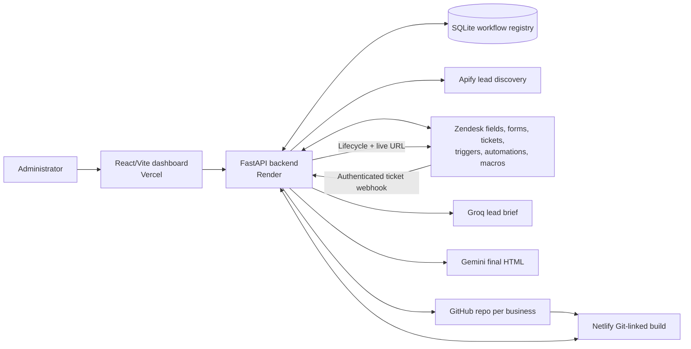
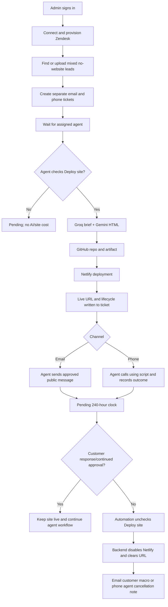

# AI Site Factory — Monthly Progress and Current-State Report

**Reporting window:** 2026-06-21 to 2026-07-21  
**Prepared:** 2026-07-21  
**Repository:** `BusiM5/AI-Site-Factory`  
**Audience:** Project owner, administrators, agents, developers, stakeholders, and demo reviewers

## 1. Executive summary

Over approximately the past month, AI Site Factory progressed from a basic lead-to-page proof of concept into an agent-controlled campaign and deployment system connected to Apify, Zendesk, AI models, GitHub, Netlify, Render, and Vercel.

The biggest change is the operating model: the application no longer treats lead discovery as permission to spend AI and deployment resources. It creates a structured campaign and separate Zendesk email/phone work queues first. A website is generated and deployed only after an agent checks the managed **Deploy site** field on a ticket. This keeps Zendesk as the operator workspace and makes each site request traceable to a campaign, lead, approval, ticket, repository, deploy, and live URL.

The application now includes:

- a secure single-administrator login;
- a visual campaign dashboard with animated metrics and graphs;
- free-form and automatically generated campaign metadata;
- mandatory mixed email and phone lead campaigns;
- CSV/JSON/JSONL imports and Apify discovery;
- a Zendesk setup wizard that builds fields before forms and optional automation;
- business-named Zendesk requesters;
- deferred, personalized website generation;
- one recoverable GitHub artifact repository per business;
- Netlify deployment, cancellation, recovery, and redeployment;
- distinct email and phone agent workflows;
- a 10-day non-response cancellation process;
- business main images, tailored color palettes, personalized services, captions, and working calls to action;
- persistent/recoverable campaign data safeguards;
- API safety diagnostics, dark/light themes, accessibility controls, and reduced-motion support;
- a substantially expanded automated backend suite.

During the reporting window, the repository recorded **56 commits**. The current full backend suite passes **130 tests**; the production frontend builds successfully; the deployed Vercel page returns HTTP 200; and the Render health endpoint reports `READY`.

## 2. Review method and evidence

This report was compiled from:

- Git history from 2026-06-21 through 2026-07-21.
- Current frontend routes, components, settings, and styling.
- Current FastAPI endpoints, database schema, provider adapters, Zendesk contracts, and recovery logic.
- Existing deployment and user-test evidence accumulated during implementation.
- The full backend automated suite and Vite production build.
- A read-only production smoke test of the public Vercel and Render endpoints.
- A read-only browser review of the deployed administrator login screen.

The browser used for this report did not have an authenticated dashboard session. No password was requested, recovered, or entered, and no live Zendesk, campaign, GitHub, Netlify, or provider state was changed. Authenticated route behavior was therefore reviewed through current source contracts, tests, API responses, and prior verified production evidence rather than by modifying live records.

## 3. Quantitative update

| Measure | Current result |
|---|---:|
| Commits in the reporting window | 56 |
| Backend test functions | 128, producing 130 passing tests through parametrization |
| Backend full-suite result | 130 passed, 2 non-failing deprecation warnings |
| Frontend production build | Passed; 1,846 modules transformed |
| Main backend implementation growth in the period | Approximately 13,632 added / 1,985 deleted lines in Git history |
| Main backend test growth in the period | Approximately 4,679 added / 214 deleted lines |
| Production frontend smoke | HTTP 200 |
| Production backend health | `READY` |
| Current major dashboard routes | 6: Overview, New campaign, Lead workspace, Deployments, Zendesk setup, Settings |
| Managed Zendesk custom fields | 20 |
| Managed Zendesk channel forms | 2 |
| Core staged Zendesk webhook triggers | 5 |

The line counts are Git-history activity indicators, not a claim that all added lines remain in the final tree; refactors and file renames can count the same logical code more than once.

## 4. Current product architecture



The dashboard is the administration and reporting surface. Zendesk is the agent/customer-workflow surface. GitHub is the durable site-artifact layer. Netlify is the live hosting layer. SQLite links all of these identities and records the campaign/deployment history.

## 5. Work completed by area

### 5.1 Frontend and user experience

The interface was rebuilt into a campaign-oriented workspace instead of a raw technical pipeline screen.

Completed work:

- Added a branded AI Site Factory shell and custom lightning/factory logo.
- Added a dedicated administrator login screen with technical grid/orbit animation.
- Added a sidebar with clear business-language navigation.
- Added an Overview command centre that explains the flow: Apify → Zendesk → AI + GitHub → Netlify.
- Added animated metric cards for campaigns, lead records, live deployments, AI generations, repositories, and pending work.
- Added deployment-health donut, conversion funnel, campaign comparison, and campaign cards.
- Added hover, entrance, chart, number-count, flow, orbit, node, and technical-grid animations.
- Added reduced-motion handling so animation does not become an accessibility barrier.
- Added light, dark, and system themes.
- Added high-contrast, text-size, focus-visibility, and reduced-motion preferences.
- Added a Settings page with session information and the API Safety Center.
- Added responsive layouts for smaller screens.
- Corrected Vercel configuration to build Vite’s `dist` output and support client-side routes.
- Added clearer notices, locked states, empty states, provider badges, and setup warnings.

Current primary routes:

| Route | User purpose |
|---|---|
| `/overview` | Portfolio-level campaign and deployment metrics. |
| `/campaigns` | Find or upload leads and create a campaign. |
| `/leads` | Inspect separate email and phone queues for one campaign. |
| `/deployments` | Inspect campaign deployment ledger and history. |
| `/zendesk` | Connect, inspect, and provision a Zendesk workspace. |
| `/settings` | Themes, accessibility, administrator session, and API safety. |

### 5.2 Administrator authentication and settings

Completed work:

- Added server-side administrator authentication.
- Added PBKDF2-SHA256 password hashing with 600,000 iterations and a random salt.
- Added an HTTP-only, HMAC-signed session cookie.
- Added configurable eight-hour default session age.
- Added automatic session invalidation when the password hash changes.
- Added a five-failed-attempt limit per IP/username within 15 minutes.
- Added login/logout/session APIs.
- Kept Zendesk and maintenance webhooks independently authenticated so Zendesk can call them without an admin browser session.
- Added `scripts/hash_admin_password.py` so a password hash can be generated without writing the password to disk.
- Added server-side API readiness reporting without returning token values.

The login remains deliberately optional only when no administrator password is configured, which allowed setup before the secure credential was added. Production should always have the hash and a separate session secret configured.

### 5.3 Campaign creation and lead qualification

Completed work:

- Added free-form campaign name, industry, location, and search intent.
- Retained industry preset cards as optional conveniences rather than mandatory values.
- Added automatic campaign-name and industry generation from discovered or uploaded rows.
- Forced the backend campaign channel set to email and phone, even if a client tries to narrow it.
- Added a hard mixed-channel validation rule: at least one valid email route and one valid phone route.
- Added clear validation messages for single-channel datasets.
- Added no-website filtering.
- Added the rule that a lead must have either email or phone contact information.
- Added canonical identity/deduplication so the same business is not repeatedly generated.
- Added website, no-contact, duplicate, raw-fetched, and eligible-result diagnostics.
- Added separate counts for email, phone, and email+phone records.
- Added broader custom search support beyond preset terms.

Important operational reality: phone numbers are common in Google Maps data, while emails for businesses with no website are uncommon. The app correctly refuses to invent email data. “Always mixed” means a campaign will only be created when both routes are present; it does not mean every Apify search can produce that data.

### 5.4 Uploaded data and demo datasets

Completed work:

- Added CSV, JSON, and JSONL upload support.
- Added flexible column-name normalization for Apify/Amplifier-style files.
- Added durable import jobs and per-row work items.
- Added small configurable processing chunks to protect Zendesk from bursts.
- Added resumable import processing and failed-row retry.
- Added input-file cleanup after all rows finish.
- Imported the supplied Google Places dataset into the application.
- Added scripts for cleaning/restoring pipeline/demo data.
- Added `scripts/export_apify_mixed_leads.py` for a new Apify token/account and JSON/CSV export.
- Added a selected 20-record demo recovery set to provide visual dashboard history after ephemeral restarts.
- Added campaign seed export and restoration.

### 5.5 Zendesk setup architecture

The Zendesk integration changed from manual field-ID entry toward a guided instance provisioner.

Completed work:

- Added connection by subdomain, administrator username/email, and API token.
- Added a read-only instance inspection before any change.
- Added discovery of fields, forms, views, webhooks, triggers, brands, exact matches, and type conflicts.
- Added a requirement to select an existing Zendesk brand.
- Added dependency-ordered provisioning:
  1. custom ticket fields;
  2. email and phone forms;
  3. optional views;
  4. optional authenticated webhook and inactive triggers.
- Added stable field descriptions/markers so IDs can be rediscovered after database loss.
- Added compatible-field adoption and safe blocking for incompatible types.
- Added idempotent resource reconciliation to avoid duplicates on rerun.
- Added a complete display of resolved instance IDs and stable automation tags.
- Added two forms: **AI Site Factory - Email Lead** and **AI Site Factory - Call Lead**.
- Added three intended views: email leads, call leads, and deployed sites.
- Added one authenticated webhook: **AI Site Factory - Ticket actions**.
- Added five inactive-on-creation triggers: email deploy, phone deploy, email cancellation, phone cancellation, and approved email send.

The setup flow does not delete Zendesk resources and deliberately does not create brands. It also does not fully recreate the instance-specific 10-day macros and automations from code; those are external dependencies currently documented and tested in the connected instance.

### 5.6 Zendesk fields, forms, and requesters

Completed work:

- Added 20 managed fields covering campaign identity, lead identity, contact details, workflow status, approvals, source, and live URL.
- Added separate email-only and phone-only fields.
- Added ticket-form and brand verification after ticket creation.
- Added managed external IDs and idempotency keys.
- Added Zendesk organizations for intake businesses.
- Fixed requester assignment so a new ticket uses an end user named for the business rather than defaulting to the API agent.
- Added deterministic requester identities for businesses that have no real email address.
- Added requester verification after ticket creation.
- Preserved the ability to assign that business end user to existing tickets manually once the end user exists, without automatically rewriting old tickets.
- Added private intake notes containing business, campaign, channel, contact, industry, location, IDs, source, and a clear statement that no site has been generated yet.

### 5.7 Deferred website generation

The previous eager-generation approach was replaced by deferred generation.

Completed work:

- Campaign intake now creates approval placeholders and tickets without calling an AI model.
- The Zendesk deploy checkbox is the generation trigger.
- Added Groq lead-context compaction into a grounded brief.
- Added Gemini final single-file HTML generation.
- Added a deterministic local Bootstrap/GSAP fallback for transient Gemini availability problems.
- Persisted generated HTML before GitHub I/O so a failed repository step does not cause another model bill.
- Added AI-generation counts to campaign metrics.
- Added regeneration/retry/reuse states.
- Added canonical-lead reuse so the email and phone channels can point to the same business artifact/site.

### 5.8 Generated website quality and personalization

Completed work:

- Added a prominent business main image when the dataset supplies one.
- Added validation/recovery for Street View and query-string image URLs.
- Added a deterministic inline SVG business image when no public main image is available.
- Added business/industry-derived default colors.
- Added a visitor-facing color/theme widget on generated pages.
- Added working `tel:`, `mailto:`, website, and in-page CTA destinations.
- Prevented empty `href`, `javascript:void(0)`, and non-functional CTA buttons.
- Added mobile-first layout and semantic accessibility requirements.
- Added business-specific taglines/captions.
- Added four personalized service cards per business rather than repeated “Local service” placeholders.
- Added business profile, service keywords, differentiators, proof points, rating/review context, source, address, and location grounding.
- Added checks to reject insufficiently personalized model output and replace it with the deterministic personalized renderer.
- Added required styling/library validation.

Generated sites are intentionally grounded in supplied public information. They must not invent awards, prices, qualifications, guarantees, employees, or unsupported services.

### 5.9 GitHub artifact management

Completed work:

- Added one site repository per canonical lead.
- Added repository names derived from business identity, timestamp, and lead hash.
- Added `README.md` and `index.html` export.
- Added repo URL, branch, commit SHA, content SHA, checksum, and export status persistence.
- Added transient GitHub 429/5xx/network retry with backoff.
- Added partial-repository recovery if repo creation succeeded before file upload failed.
- Added retry-export endpoint and reusable saved HTML.
- Added repository reuse for later requests/regeneration.

This created a durable, auditable artifact boundary between AI generation and Netlify hosting.

### 5.10 Netlify deployment lifecycle

Completed work:

- Added Git-linked Netlify site creation and build triggering.
- Added GitHub installation selection and link verification.
- Added site/build/deploy ID and public URL polling/persistence.
- Added direct Netlify deployment as an explicit fallback when Git linkage fails.
- Added account/site recovery when prior local Netlify metadata is missing.
- Added site disable when the Zendesk deploy checkbox is unchecked.
- Added ticket live-URL recovery so cancellation can work after a Render restart.
- Added re-enable before redeploy for a previously disabled/recovered site.
- Preserved the GitHub artifact after cancellation.
- Added existing-deployment reuse for the same lead.

### 5.11 Zendesk deployment webhook reliability

Completed work:

- Added independent shared-secret authentication.
- Added stable body fields for action, approval ID, canonical lead key, ticket ID, and channel.
- Added orphan-ticket recovery from managed Zendesk fields/tags.
- Added strict identity checks to stop approval/ticket/channel mismatches.
- Added persistent webhook-event audits.
- Added lease-based deployment claims to handle duplicate/concurrent Zendesk webhook delivery.
- Added `IN_PROGRESS` and `ALREADY_PROCESSED` idempotent responses.
- Added private lifecycle notes and tags for requested, generating, artifact ready, deploying, live, failed, and cancelled states.
- Fixed initial deployment incorrectly satisfying the cancellation trigger by preserving the deploy checkbox tag before adding live tags.
- Fixed failed deployment field changes from immediately retriggering another deploy.
- Added email-only validation for `send_email` and phone-only validation for `phone_status`.

### 5.12 Email, phone, and 10-day workflows

Completed work:

- Added a separate approved-email checkbox/webhook rather than automatically sending during deployment.
- Added grounded email content with source and live link.
- Added a phone-only agent workflow and call-status field.
- Added channel-specific macros for site-active/site-deployed communication.
- Added email and phone 10-day cancellation macros/scripts.
- Corrected the original cancellation logic so a new deployment is not cancelled immediately.
- Added the required sequence:
  1. deploy;
  2. notify customer and set pending;
  3. wait 240 pending hours;
  4. add due tag and uncheck deploy;
  5. backend disables Netlify;
  6. email macro is applied or phone agent note is added.
- Added scheduled-cancellation detection based on the live Zendesk due tag.
- Ensured the customer message occurs after successful Netlify disable.

### 5.13 Persistence and restart recovery

Completed work:

- Added SQLite schema for campaigns, separate channels, deployments, imports, pipelines, approvals, artifacts, tickets, webhooks, and settings.
- Added idempotent schema upgrades/backfills.
- Added pipeline seed export/restore.
- Added startup recovery from managed Zendesk tickets.
- Added field-ID reconciliation from stable descriptions after restart.
- Added selected demo-ticket recovery to keep useful visual history.
- Declared a Render Starter service with a 1 GB persistent disk in `render.yaml`.
- Added `/var/data/pipeline.db` and `/var/data/uploads` paths for paid persistent deployment.

Current risk: a Render service that is still actually running on Free cannot use the declared persistent disk. Zendesk/seed recovery is a safety net, not a complete database backup.

### 5.14 Reporting, operations, and API safety

Completed work:

- Added reporting summary and deployment-history APIs.
- Added campaign funnel totals and per-campaign detail.
- Added operation groups linking tickets, repo artifacts, builds, and live URLs.
- Added pipeline step histories and structured errors.
- Added sanitized in-memory/file logging and request IDs.
- Added provider environment readiness status.
- Added safe provider probes for Apify, Gemini, Groq, GitHub, Netlify, and Zendesk.
- Kept raw provider tokens out of browser responses.
- Added public backend health endpoint.

## 6. Timeline of notable changes

| Date | Milestone |
|---|---|
| Jun 23 | Development port/CORS fixes, code restructuring, database update, and Netlify linkage/deployment repairs. |
| Jul 1–2 | Site-generation workflow refactor, Gemini fallback, and Netlify account-migration handling. |
| Jul 8 | Generated hero visuals and working CTA enforcement. |
| Jul 10 | Operations Hub revamp, additional Vercel CORS support, channel validation, and enhanced discovery. |
| Jul 15 | Pipeline UI cleanup, Vercel/Vite deployment configuration, and pipeline seed export/restore. |
| Jul 16 | Zendesk setup and routing improvements, expanded tests, GitHub App/Netlify linking, and generated-site text/theme repair. |
| Jul 17 | Dashboard recovery, custom campaign search, demo-data reset/restore, uploaded business images, and business requester assignment. |
| Jul 20 | Full cancellation recovery and 10-day timing, GitHub retry/idempotency, checkbox-trigger protections, image refresh, business-specific themes/services/captions, admin security/settings, mixed campaign controls, Zendesk state recovery, and Apify export tooling. |

## 7. Current end-to-end business flow



## 8. Quality and testing status

### Passed

- Full backend suite: **130 passed**.
- Python compilation: passed.
- Vite production build: passed.
- Git patch hygiene: passed.
- Vercel production route: HTTP 200.
- Render health endpoint: `READY`.

The backend tests cover campaign validation/imports, Zendesk provisioning/requesters/webhooks/macros, deferred generation, GitHub/Netlify recovery and cancellation, authentication, API safety, reporting, persistence, images/themes/personalization, and failure/idempotency paths. Third-party operations are mocked so the suite is deterministic and does not create billable resources.

### Warnings and gaps

- Two non-failing FastAPI warnings indicate that `@app.on_event("startup")` should migrate to the lifespan API.
- `frontend/src/App.test.js` contains UI test cases, but `npm test` is currently configured only to run the Vite build. A frontend test runner should be restored so those tests execute in CI.
- There is no persisted per-provider token/cost ledger yet.
- A live provider probe or billable end-to-end deployment is a controlled acceptance test, not part of the default automated suite.

## 9. Current limitations and priority next actions

### P0 — before the next production generation test

1. **Replace the configured Gemini text model.** The current local configuration names `gemini-2.0-flash`, which Google reports was shut down on 2026-06-01. Select an available approved model, then run the Gemini safety probe and one controlled personalized-site test.
2. **Confirm Render persistence.** Verify that the running service—not only `render.yaml`—is on Starter and has the 1 GB disk mounted at `/var/data`.

### P1 — before high-volume campaigns

1. Add a durable background job queue so Zendesk webhooks return quickly while generation/deployment runs asynchronously.
2. Add provider token/unit/cost ledger and campaign budgets.
3. Add provider-specific throttles for GitHub content creation, Zendesk API calls, AI quotas, and Netlify credits.
4. Version or provision the complete 10-day Zendesk macros/automations so a new instance can be reproduced from code.
5. Re-enable executable frontend component tests in CI.
6. Add database backups, restore drills, and retention/deletion policy.

### P2 — product maturity

1. Add roles/multiple administrators rather than one shared administrator.
2. Add customer acceptance/handover, custom domain, billing, and ownership-transfer workflows.
3. Add suppression lists, consent/legal-basis controls, and end-to-end lead deletion.
4. Consider multi-tenant hosting or a different site topology before attempting thousands of independent Netlify sites.
5. Deprecate legacy Phase 1 API endpoints that are not part of the campaign workflow.

## 10. Password-change procedure

### 10.1 What is being changed

The login password is not stored as plain text. The backend stores a PBKDF2-SHA256 hash in `ADMIN_PASSWORD_HASH`. Changing this hash automatically changes the credential version, so every existing administrator session cookie becomes invalid and users must sign in again.

Do not put the password or password hash in Vercel, frontend source, browser storage, or any variable beginning with `VITE_`.

### 10.2 Generate a new hash

From the repository root in PowerShell:

```powershell
.\.venv\Scripts\python.exe scripts\hash_admin_password.py
```

If the virtual environment is unavailable, use an installed Python:

```powershell
python scripts\hash_admin_password.py
```

The script will prompt twice. The password must be at least 12 characters. Nothing appears while typing, which is normal. It prints one value similar to:

```text
pbkdf2_sha256$600000$<random-salt>$<derived-hash>
```

Copy the entire line, including all dollar signs. Do not add quotes or spaces.

### 10.3 Change it locally

1. Open `backend/.env`.
2. Replace only the value after `ADMIN_PASSWORD_HASH=` with the newly generated complete hash.
3. Ensure any old plaintext `ADMIN_PASSWORD=` fallback is removed or blank.
4. Keep `ADMIN_USERNAME` unchanged unless the username should also change.
5. Restart the backend process.
6. Reload the frontend and sign in with the new password.

Changing the hash invalidates existing sessions automatically. Rotate `ADMIN_SESSION_SECRET` as well if you suspect the old session secret was exposed; rotating it also invalidates every session.

### 10.4 Change it on Render

1. Sign in to Render and open the **ai-site-factory-backend** web service.
2. Open **Environment**.
3. Find `ADMIN_PASSWORD_HASH` and choose Edit.
4. Paste the entire generated `pbkdf2_sha256$...` value as the value. Do not paste the plain password.
5. Verify `ADMIN_USERNAME` contains the intended login name.
6. Verify `ADMIN_SESSION_SECRET` is a separate random value of at least 32 characters.
7. Remove `ADMIN_PASSWORD` if that plaintext fallback exists.
8. Save the environment changes and let Render restart/redeploy the service.
9. Wait for `/api/health` to return `READY`.
10. Open the Vercel app in a private window and sign in with the username and new plain password.

No Vercel environment change is required because verification happens on Render.

### 10.5 Verification and recovery

Expected behavior after the Render restart:

- Old sessions receive 401 and return to the login screen.
- The new password signs in.
- The old password returns “username or password is incorrect.”
- Zendesk webhooks keep working because they use `ZENDESK_WEBHOOK_SECRET`, not the administrator session.

If the new login fails:

1. Confirm no part of the hash was truncated by the environment editor.
2. Confirm the value begins `pbkdf2_sha256$600000$`.
3. Confirm the username’s capitalization matches `ADMIN_USERNAME` exactly.
4. Check Render logs for configuration—not the password itself.
5. Generate a second hash and replace the value again.
6. As a last rollback, restore the previous known-good hash; never temporarily expose a plain password in frontend code.

## 11. Related documentation

- [Architecture, FRS, use cases, webhooks, and cost model](ARCHITECTURE_FRS_USE_CASES_COSTS.md)
- [POC deployment guide](POC_DEPLOYMENT.md)
- [Repository overview](../README.md)
- [Full application demo script](FULL_APP_DEMO_SCRIPT.md)

