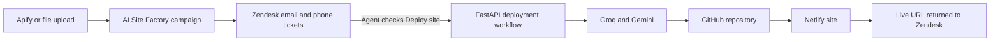

# AI Site Factory — 10–15 Minute Demo Script

**Recommended duration:** 12 minutes  
**Audience:** Business stakeholders, Zendesk administrators, technical reviewers, and project sponsors  
**Goal:** Show how a lead becomes a controlled, personalized website deployment without generating a site before an agent approves it.

## Browser setup and click-by-click cue sheet

### Prepare these tabs before anyone joins

Open the tabs in this exact order:

| Tab | Open before the demo | Purpose |
|---:|---|---|
| 1 | AI Site Factory Vercel login page | Start, log in, and navigate around the app. |
| 2 | One prepared undeployed Zendesk test ticket | Show intake data and request the deployment. |
| 3 | Zendesk Admin Center → AI Site Factory - Ticket actions | Show the webhook connection without exposing its secret. |
| 4 | One previously generated AI Site Factory GitHub repository | Reliable artifact example if a live provider is slow. |
| 5 | The corresponding Netlify deployment/dashboard page | Show hosting and deployment identity. |
| 6 | The corresponding live generated website | Show the personalized output immediately. |
| 7 | A completed 10-day cancellation test ticket or automation page | Explain cancellation without changing the production timer. |

Also prepare a mixed demo campaign in advance. It should contain at least one email lead and one phone lead. Choose one undeployed ticket that is safe to deploy during the presentation.

### Live sequence

#### 0:00–0:45 — Start on Tab 1: login

1. Keep the login page visible as people join.
2. Introduce the purpose of the application.
3. Enter the prepared username and password privately.
4. Click **Sign in securely**.
5. Do not open Render or show environment variables.

**Say:** Use **Step 1** and **Step 2** from the verbatim script below.

#### 0:45–1:45 — Stay on Tab 1: Overview

1. Wait for `/overview` to load.
2. Point to the large campaign-command-centre banner.
3. Point from Apify → Zendesk → AI + GitHub → Netlify.
4. Move across the six metric cards.
5. Scroll only enough to show deployment health and the campaign funnel.
6. Do not spend time opening individual dashboard cards.

**Say:** Use **Step 3**.

#### 1:45–2:45 — Tab 1: New campaign

1. Click **New campaign** in the left navigation.
2. Point to **Find leads** and **Upload lead data**.
3. Point to campaign name, location, industry, search intent, and lead target.
4. Point to the automatic campaign/industry option.
5. Do not run a large live Apify search during the short demo.
6. Explain that the prepared mixed campaign will be used.

**Say:** Use **Step 4**.

#### 2:45–3:45 — Tab 1: Lead workspace

1. Click **Lead workspace**.
2. Select the prepared campaign in the campaign selector.
3. Click **Email Leads** and point to one row.
4. Click **Call Leads** and point to one row.
5. Point to business, contact, source, Zendesk, deploy request, and status columns.
6. Use the Zendesk link for the selected undeployed test ticket, or switch manually to Tab 2.

**Say:** Use **Step 5**.

#### 3:45–5:00 — Tab 2: undeployed Zendesk ticket

1. Point to the business-named requester at the top.
2. Point to the ticket title and Email Lead or Call Lead form.
3. Point down the left-side fields: business, contact, industry, address, channel, lead status, Deploy site, and Live site URL.
4. Show the first internal intake note.
5. Confirm verbally that **Deploy site is unchecked** and **Live site URL is blank**.
6. Do not check Deploy yet.

**Say:** Use **Step 6**.

#### 5:00–5:40 — Tab 3: webhook connection

1. Switch to Zendesk Admin Center.
2. Show **AI Site Factory - Ticket actions**.
3. Point to its active status and the Render backend endpoint.
4. If useful, show the associated event subscriptions/triggers.
5. Do not open request headers, authentication values, or secrets.
6. Switch back to Tab 2.

**Say:** Use **Step 7**.

#### 5:40–7:15 — Tab 2: request deployment

1. Check **AI Site Factory - Deploy site**.
2. Submit the ticket once.
3. Point to the first internal “deployment requested” note.
4. Refresh only once if necessary; do not repeatedly toggle the checkbox.
5. Explain the generate → save → GitHub → Netlify → Zendesk stages while processing continues.
6. If the live run succeeds quickly, point to the live URL and deployed status.
7. If it is still processing after about 60–90 seconds, say that external providers run asynchronously and continue with the prepared evidence.

**Say:** Use **Step 8**.

#### 7:15–7:50 — Tab 4: GitHub artifact

1. Show the repository name.
2. Point to `README.md` and `index.html`.
3. Point to the latest commit.
4. Do not browse repository secrets or settings.

**Say:** Use the GitHub paragraph in **Step 9**.

#### 7:50–8:20 — Tab 5: Netlify deployment

1. Show the site name and linked GitHub repository.
2. Show the production deployment status.
3. Point to the public URL.
4. Do not open environment variables or access tokens.

**Say:** Use the Netlify paragraph in **Step 9**.

#### 8:20–9:30 — Tab 6: generated website

1. Open or refresh the live page.
2. Point to the hero image and business name.
3. Point to the caption/tagline and color palette.
4. Scroll to the four services.
5. Point to location/contact information.
6. Demonstrate one safe in-page navigation action.
7. Do not click a real telephone or email link unless the test environment is prepared.
8. Narrow the window briefly only if responsive behavior is important to the audience.

**Say:** Use **Step 10**.

#### 9:30–10:15 — Tab 2: channel workflows

1. Return to the Zendesk ticket.
2. Point to the deployed macro or approved-email action for an email ticket.
3. If using a phone ticket, point to the call-status field and call macro.
4. Explain the other channel verbally instead of opening many tickets.
5. Do not send a real email or call a real lead during the demo.

**Say:** Use **Step 11**.

#### 10:15–11:10 — Tab 7: 10-day cancellation evidence

1. Show the 240 pending-hour automation condition or completed cancellation ticket.
2. Point to the cancellation-due and cancelled tags.
3. Show the cancellation macro/public email for the email channel or the internal call note for the phone channel.
4. Explain that Netlify is disabled before the final communication action.
5. Do not shorten or edit the production 240-hour rule during the presentation.

**Say:** Use **Step 12**.

#### 11:10–12:15 — Tab 1: Deployments and Overview

1. Return to AI Site Factory.
2. Click **Deployments** and point to campaign, business, channel, status, repository, live URL, and deployment history.
3. Click **Overview**.
4. Point again to AI generations, repositories, live, pending, and failed counts.
5. Deliver the cost-control and closing statement.
6. Stop navigating and invite questions.

**Say:** Use **Step 13**.

### If the live deployment finishes later

When the live run completes, return briefly to Tab 2 and show:

1. the successful internal lifecycle note;
2. deployed/live lead status;
3. populated Live site URL;
4. deployment tags;
5. the URL opening the correct Netlify page.

If it fails, do not repeatedly resubmit. Show the failure note, explain the saved-artifact retry/recovery path, and use Tabs 4–6 as the successful reference example.

## Verbatim presenter script

Use the following as the exact talk track. Text inside brackets is a presenter action and should not be read aloud.

### Step 1 — Open the login page

**[Show the AI Site Factory login page.]**

> Welcome. This is AI Site Factory, a lead-to-site campaign platform. Its purpose is to find or import businesses that do not have websites, place those businesses into controlled Zendesk workflows, and generate a personalized website only when an agent approves it.

> The main benefit is control. Finding a lead does not immediately spend money on an AI model, GitHub repository, or Netlify deployment. The agent decides which leads are worth deploying.

### Step 2 — Sign in

**[Enter the prepared administrator credentials without exposing the password, and select Sign in securely.]**

> The application has a dedicated administrator login. The password is checked by the backend and is not stored in the frontend or in browser storage. The backend stores a salted password hash and gives the browser a signed, HTTP-only session cookie.

### Step 3 — Explain the Overview

**[Open Overview and slowly point across the headline, system-flow panel, metric cards, deployment chart, and campaign funnel.]**

> This is the campaign command centre. At the top, we can see the complete connection: Apify supplies lead information, Zendesk manages the agent and customer workflow, AI and GitHub create and store the website, and Netlify publishes it.

> These cards show the current number of campaigns, lead records, live deployments, AI generations, repositories created, and deployments waiting for action. The graphs show deployment health and how records move from discovery through to a live site.

> The frontend is a React and Vite application hosted on Vercel. It communicates over HTTPS with a FastAPI backend hosted on Render. The backend owns the business rules, provider connections, authentication, and workflow database.

### Step 4 — Show campaign creation

**[Select New campaign.]**

> A campaign can start in two ways. We can ask Apify to find leads, or upload an existing CSV, JSON, or JSONL file.

**[Point to campaign name, industry, location, search intent, and automatic metadata controls.]**

> The administrator can enter any campaign name, industry, location, and search intent. These values are not limited to preset cards. We can also ask the application to generate a suitable campaign name and industry from the businesses in an uploaded or discovered dataset.

> The qualification rule is important. The business must not already have a website, and it must have a usable phone number or email address. A campaign must contain both an email route and a phone route before it is accepted as mixed. The application never invents missing contact data.

> At this stage, no website is generated. We are only qualifying and organizing leads.

### Step 5 — Show the Lead workspace

**[Open Lead workspace and select the prepared mixed campaign.]**

> This campaign has two separate work queues. Email leads contain a usable email address and follow an email communication process. Call leads contain a public phone number and follow an agent call process.

**[Select Email Leads, then Call Leads. Point to business, contact, source, Zendesk ticket, deploy request, and status.]**

> Each record keeps the business information, public source, Zendesk ticket, deployment request, and current status together. The source link lets an agent confirm where the lead was found.

> The backend also creates a canonical business identity. That helps prevent duplicate sites when the same business appears in another search or in both communication channels.

### Step 6 — Open a Zendesk ticket

**[Open one prepared, undeployed Zendesk ticket from the lead row.]**

> This is the agent workspace. The requester is named after the business instead of being incorrectly assigned to the API administrator. The business does not need to have an existing Zendesk account.

**[Point to the requester, business fields, correct form, contact channel, source, internal intake note, unchecked Deploy site field, and blank live URL.]**

> The ticket has the correct email or phone form and contains the campaign, business, contact, industry, location, source, approval identity, and workflow status. The first note is internal and tells the agent that no AI site has been generated yet.

> AI Site Factory can provision these Zendesk resources in dependency order. It reconciles custom fields first, forms second, views third, and the optional webhook and triggers last. This prevents forms from referring to fields that do not exist.

### Step 7 — Explain the Zendesk webhook

**[Briefly show the AI Site Factory - Ticket actions webhook in Zendesk Admin Center. Do not open or reveal its secret.]**

> Zendesk and the backend are connected through an authenticated ticket-actions webhook. When an agent changes a managed action field, Zendesk sends the action, approval ID, canonical lead key, ticket ID, and channel to the FastAPI endpoint.

> The webhook uses a secret that is separate from the administrator login. The backend validates the secret and confirms that the approval, business, ticket, and channel all match. Duplicate deliveries are handled safely so that one ticket action does not create multiple sites.

### Step 8 — Request a deployment

**[Return to the prepared undeployed ticket. Check AI Site Factory - Deploy site and submit the ticket once.]**

> This checkbox is the approval and cost-control boundary. Before I submit it, this lead has a ticket, but it does not have an AI-generated site, GitHub repository, or Netlify deployment.

**[Submit once. Do not repeatedly toggle the field.]**

> Zendesk has now requested the deployment. The backend first uses the supplied public lead information to create a grounded business brief. Groq performs the briefing stage, and Gemini produces the final single-file HTML website.

> The generated HTML is saved before GitHub is called. This matters because if GitHub has a temporary failure, we can retry the repository step without paying for another AI generation.

> The backend then creates or recovers one GitHub repository for this business, writes the README and index file, and records the commit. Netlify connects to that repository and publishes the site.

> Finally, the site, build, deployment, repository, and commit identifiers are stored, and Zendesk receives the live URL, lifecycle tags, status, and an internal deployment note.

**[If the live run needs more time, open the prepared GitHub repository and Netlify deployment while it completes.]**

### Step 9 — Show GitHub and Netlify

**[Open the business GitHub repository.]**

> GitHub is the durable website-artifact layer. It gives us an inspectable index file, README, repository identity, and commit history for the generated site.

**[Open the matching Netlify deployment.]**

> Netlify is the hosting layer. It publishes the GitHub artifact and gives the application the production URL. The backend records the Netlify site, build, and deployment identifiers so the site can be audited, disabled, recovered, or redeployed later.

### Step 10 — Show the generated site

**[Open the live site from Zendesk or the Deployments page.]**

> This page is personalized from the information available for this specific business. It is not only a generic template with the business name changed.

**[Point to each item as it is mentioned.]**

> It includes the business image when one was supplied, an industry-appropriate color palette, a personalized caption, four distinct service sections, business location and contact context, and working call, email, and navigation actions. It is also designed for desktop and mobile use.

> The generator is not allowed to invent awards, prices, qualifications, employees, guarantees, or unsupported services. If the AI response is not sufficiently personalized or contains broken actions, the backend can replace or repair it using a grounded deterministic renderer.

### Step 11 — Explain the two customer workflows

**[Return to Zendesk and show an email ticket, then a call ticket or their macros.]**

> After deployment, email and phone records continue through different workflows. For an email lead, the agent reviews and authorizes the customer message containing the live link. Deployment itself does not automatically send an unreviewed email.

> For a phone lead, the agent uses the call script, explains the site, and records the outcome using the call-status field. A phone-only record is never forced into an email workflow.

### Step 12 — Explain the 10-day cancellation

**[Show the prepared production automation conditions, macro, tags, or an already completed cancellation test ticket.]**

> Once the deployed-site notification is sent, the ticket moves to pending and the 10-day clock starts. The production period is 240 pending hours.

> If the customer does not respond, Zendesk adds the cancellation-due tag and unchecks Deploy site. The backend then disables the Netlify site, clears the live URL, and updates the ticket.

> For the email channel, the customer receives the cancellation message. For the phone channel, the agent receives an internal note instructing them to make the cancellation call.

> The GitHub repository is deliberately retained. If the business wants to continue later, the same artifact can be recovered and redeployed instead of creating everything again.

### Step 13 — Close on reporting and value

**[Open Deployments and then return to Overview.]**

> The deployment ledger connects the campaign, business, communication channel, Zendesk ticket, approval, AI generation, GitHub repository, Netlify deployment, and live URL.

> This means the business can report how many leads were found, how many tickets were created, how many agents requested websites, how many AI generations occurred, how many repositories were created, and how many sites are pending, live, failed, or cancelled.

> The main cost control is deferred generation. A campaign can contain 10,000 leads, but if agents approve only 500, only those 500 require first-time AI generation and deployment resources.

> In summary, AI Site Factory connects lead discovery, Zendesk-controlled approval, personalized AI generation, auditable GitHub storage, Netlify hosting, customer follow-up, cancellation, recovery, and campaign reporting in one workflow.

> Thank you. I am happy to demonstrate any individual stage again or answer questions about the business process, Zendesk automation, webhook security, AI generation, or hosting architecture.

## Before the demo

Have these ready in separate browser tabs:

1. AI Site Factory login page.
2. AI Site Factory Overview.
3. A prepared mixed campaign containing email and phone leads.
4. One undeployed Zendesk test ticket.
5. Zendesk Admin Center webhook page.
6. A previously generated GitHub repository.
7. A previously deployed Netlify site.

Do not display API tokens, passwords, webhook secrets, session cookies, or Render environment-variable values.

## Demo timeline

| Time | Section | Main point |
|---:|---|---|
| 0:00–1:00 | Introduction | Explain the business problem and controlled workflow. |
| 1:00–2:00 | Login and Overview | Show security, campaign metrics, and the system flow. |
| 2:00–4:00 | Campaign and leads | Show mixed email/phone intake and qualification rules. |
| 4:00–6:00 | Zendesk connection | Show forms, fields, requester, ticket, and webhook contract. |
| 6:00–9:00 | Deploy a website | Trigger AI, GitHub, Netlify, and Zendesk updates. |
| 9:00–10:30 | Generated site | Show personalized content, image, colors, services, and CTAs. |
| 10:30–11:30 | Cancellation | Explain the 10-day lifecycle and channel-specific follow-up. |
| 11:30–12:30 | Reporting and close | Show metrics, technical safeguards, and the value proposition. |

## 1. Introduction — 1 minute

**Screen:** AI Site Factory login page or title slide.

**Say:**

> AI Site Factory turns qualified businesses without websites into controlled website opportunities. Apify or an uploaded file supplies the lead data, Zendesk manages the agent workflow, AI creates the site only after approval, GitHub stores the website artifact, and Netlify publishes it.

> The key design decision is deferred generation. Finding a lead does not automatically spend AI or deployment resources. The agent must first check the Deploy site field on the Zendesk ticket.

Show this connection briefly:



## 2. Login and Overview — 1 minute

**Screen:** Log in, then open `/overview`.

**Action:** Sign in with the prepared administrator account. Do not reveal the password.

**Say:**

> Authentication is verified by the Render-hosted backend. The browser never stores the password. The backend stores a salted PBKDF2-SHA256 hash and returns a signed, HTTP-only session cookie.

On the Overview screen, point out:

- campaigns and total lead records;
- AI generations and repositories created;
- live, pending, failed, and cancelled deployments;
- deployment-health and campaign-funnel graphs;
- the visible flow from Apify to Zendesk, AI/GitHub, and Netlify.

**Technical detail:** Vercel hosts the React/Vite frontend. Render hosts the FastAPI backend and SQLite workflow registry. The frontend calls the backend over HTTPS with credentials enabled for the administrator session.

## 3. Campaign and lead intake — 2 minutes

**Screen:** `/campaigns`, followed by `/leads`.

**Say:**

> An administrator can search through Apify or upload CSV, JSON, or JSONL data. Campaign name, industry, location, and search intent can be entered freely or generated from the returned data.

> The business rules deliberately target businesses with no existing website and at least one usable contact route. A mixed campaign must contain both an email route and a phone route. The system does not invent missing contact information.

Show:

1. Campaign name, industry, location, and intent.
2. Find leads and Upload lead data options.
3. Automatic campaign metadata option.
4. The prepared campaign in Lead workspace.
5. Separate **Email Leads** and **Call Leads** tabs.
6. Business name, contact, public source, Zendesk ticket, deploy state, and status.

**Technical detail:**

- Existing websites and records without phone or email are filtered out.
- Canonical business keys reduce duplicates across searches and channels.
- Large uploads are stored as jobs and processed in small resumable chunks.
- No AI site is created during intake.

## 4. Zendesk connection — 2 minutes

**Screen:** Open one prepared Zendesk ticket and, briefly, `/zendesk` or the Admin Center webhook page.

**Say:**

> AI Site Factory connects to an administrator-selected Zendesk instance using its subdomain, administrator email, and API token. The setup process creates or reconciles fields first, forms second, views third, and optional webhook automation last.

On the ticket, show:

- the business name as the requester;
- the Email Lead or Call Lead form;
- business, campaign, contact, industry, source, and workflow fields;
- the internal intake note;
- the unchecked **AI Site Factory - Deploy site** field;
- the blank live-site URL before deployment.

**Say:**

> Customers do not need existing Zendesk accounts. The backend creates a deterministic end user named after the business and assigns that user as the requester. Email and phone leads use different forms and agent actions.

Show the webhook name and endpoint, but not its secret.

**Technical detail:** Zendesk sends a signed/shared-secret POST request to:

```text
POST /api/zendesk/webhook
```

The body identifies the action, approval, canonical business, Zendesk ticket, and channel. The backend validates the secret and checks that these identities agree before doing work. Duplicate webhook deliveries are handled idempotently.

## 5. Deploy a personalized website — 3 minutes

**Screen:** Prepared undeployed Zendesk ticket.

**Action:** Check **AI Site Factory - Deploy site** and submit the ticket once.

**Say:**

> This is the approval and cost-control boundary. Until this field is checked, the application has created the lead and ticket but has not generated or deployed a website.

As the ticket updates, explain the stages:

1. **Generate:** Groq converts the supplied public lead information into a compact grounded brief. Gemini produces the single-file HTML page. A deterministic local renderer is available for certain model failures.
2. **Save:** The HTML is stored before GitHub is called. If GitHub fails, retrying does not require another AI generation.
3. **Artifact:** The backend creates or recovers one GitHub repository for the canonical business and writes `README.md` and `index.html`.
4. **Deploy:** Netlify creates or reuses a Git-linked site and runs the production deployment.
5. **Return:** The backend stores repository, commit, site, build, and deploy identifiers and updates Zendesk with the live URL, status, tags, and private lifecycle note.

If the live provider process is taking too long, show the prepared repository, Netlify deployment, and completed Zendesk ticket instead of repeatedly toggling the field.

**Technical safeguards to mention:**

- webhook secret authentication;
- approval/ticket/channel identity validation;
- deployment claim lease for concurrent deliveries;
- canonical lead and existing-site reuse;
- GitHub retry and partial-repository recovery;
- saved HTML reuse after an external failure;
- private Zendesk lifecycle notes and auditable tags.

## 6. Generated website — 1.5 minutes

**Screen:** Open the live Netlify URL.

**Say:**

> The output is personalized from the supplied public business data rather than only replacing a business name in a generic page.

Show:

- the business main image, or its generated fallback image;
- industry-aligned colors;
- business-specific caption or tagline;
- four personalized service cards;
- address, location, source, rating, or review context when available;
- working call, email, and navigation actions;
- responsive/mobile layout;
- visitor-facing color controls.

**Technical detail:** The backend validates personalization and CTA targets. It must not invent unsupported awards, prices, qualifications, employees, guarantees, or services. Insufficient model output can be replaced with the grounded deterministic renderer.

## 7. Ten-day cancellation and agent follow-up — 1 minute

**Screen:** Show a prepared cancellation example, macro, automation conditions, or completed ticket.

**Say:**

> After deployment, the email macro informs the customer, or the call workflow tells the agent what to discuss. The production ticket is moved to pending and the 10-day clock starts.

> If there is no response after 240 pending hours, Zendesk adds the cancellation-due tag and unchecks Deploy site. The backend disables the Netlify site, clears the live URL, and updates the ticket. Email leads receive the cancellation message; phone leads receive an internal note instructing the agent to make the cancellation call.

**Technical detail:** The GitHub repository is retained. Rechecking Deploy site can recover and redeploy the same artifact. Cancellation can also recover the Netlify site identity from the live URL after a backend restart.

Do not change the production 240-hour rule during this short demo. Use an already tested ticket or prepared evidence.

## 8. Reporting and close — 1 minute

**Screen:** `/deployments`, then `/overview`.

**Say:**

> The deployment ledger connects campaign, business, channel, Zendesk ticket, approval, AI generation, GitHub repository, Netlify deployment, and live URL. The dashboard shows what has been discovered, requested, generated, deployed, failed, cancelled, or left pending.

> This design controls cost because AI and Netlify work happen only for agent-approved leads. A campaign may contain 10,000 leads, but if agents approve 500, only those 500 require first-time site generation and deployment.

> In summary, the application connects lead discovery, Zendesk-controlled approval, personalized AI generation, auditable GitHub artifacts, Netlify hosting, customer follow-up, cancellation, and reporting in one recoverable workflow.

## Short technical summary for questions

| Area | Current implementation |
|---|---|
| Frontend | React and Vite on Vercel. |
| Backend | FastAPI on Render. |
| Operational data | SQLite, with persistent Render storage required for production durability. |
| Lead source | Apify Google Places actor or CSV/JSON/JSONL upload. |
| CRM/workflow | Zendesk fields, forms, tickets, triggers, macros, automations, tags, and webhooks. |
| AI | Groq business brief followed by Gemini HTML generation, with deterministic fallback rendering. |
| Artifact | One recoverable GitHub repository per canonical business. |
| Hosting | Git-linked Netlify site, with disable/re-enable/redeploy support. |
| Authentication | PBKDF2 password hash and signed HTTP-only administrator session. |
| Webhook protection | Separate shared secret, identity validation, idempotency, event audit, and deployment leases. |
| Cost control | Deferred generation; exact provider token ledger is still a planned production-hardening item. |

## If there are only 10 minutes

Shorten the presentation as follows:

- Use a prepared campaign instead of creating one live.
- Show only one Zendesk channel ticket and explain the second channel verbally.
- Trigger one deployment or show one previously completed deployment.
- Show the 10-day workflow diagram/tags rather than testing cancellation.
- Spend the final minute on the end-to-end connection and cost-control message.

## One-sentence closing

> AI Site Factory finds or imports qualified leads, gives Zendesk agents control over when money is spent, generates a grounded personalized site, stores it in GitHub, deploys it through Netlify, and returns the complete lifecycle to Zendesk and the campaign dashboard.
